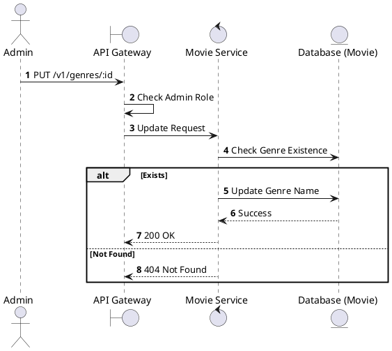
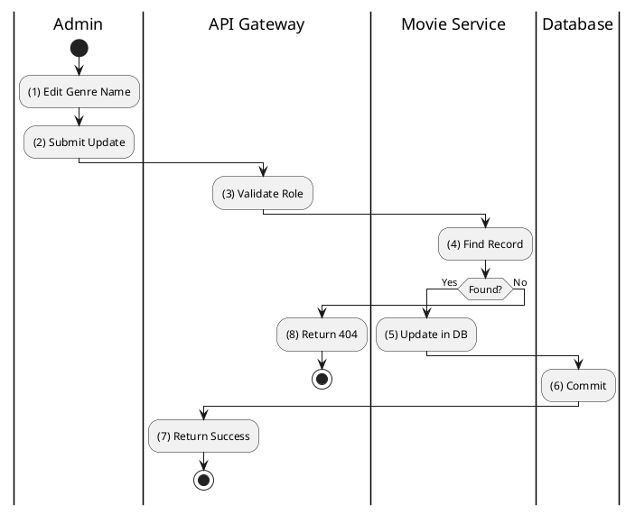

# [GM-04] Update Genre

## 1. Description

| Field | Details |
| :--- | :--- |
| **Name** | Update Genre |
| **Functional ID** | GM-04 |
| **Description** | Modifies an existing movie genre's name. |
| **Actor** | Admin |
| **Trigger** | `PUT /v1/genres/:id` |
| **Pre-condition** | Admin authenticated; Genre ID exists. |
| **Post-condition** | Genre record updated. |

## 2. Sequence Flow

## 3. Activity Flow

## 4. Business Rules

| Activity Step | Rule ID | Description |
| :--- | :--- | :--- |
| (5) | General | Updated genre name must not conflict with other existing genre names. |
