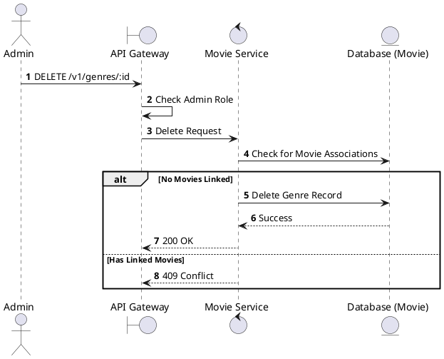
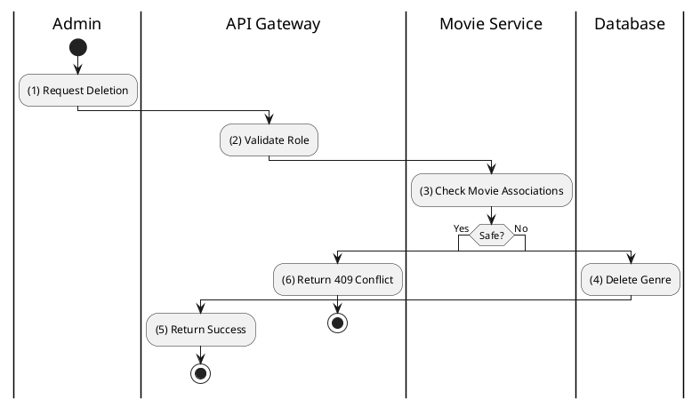

# [GM-05] Delete Genre

## 1. Description

| Field | Details |
| :--- | :--- |
| **Name** | Delete Genre |
| **Functional ID** | GM-05 |
| **Description** | Removes a movie genre from the system. |
| **Actor** | Admin |
| **Trigger** | `DELETE /v1/genres/:id` |
| **Pre-condition** | Admin authenticated; Genre ID exists. |
| **Post-condition** | Genre record removed. |

## 2. Sequence Flow

## 3. Activity Flow

## 4. Business Rules

| Activity Step | Rule ID | Description |
| :--- | :--- | :--- |
| (3) | General | A genre cannot be deleted if there are movies currently associated with it. |
