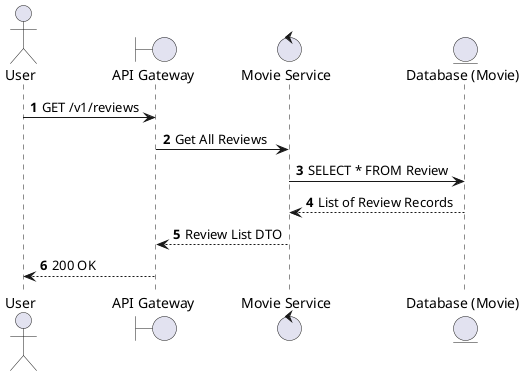
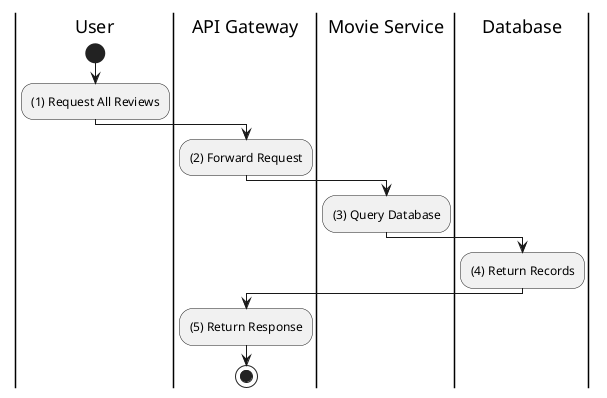

# [RV-01] List Reviews

## 1. Description

| Field | Details |
| :--- | :--- |
| **Name** | List Reviews |
| **Functional ID** | RV-01 |
| **Description** | Retrieves a list of all reviews in the system, supporting administrative oversight. |
| **Actor** | Guest, Member |
| **Trigger** | `GET /v1/reviews` |
| **Pre-condition** | None. |
| **Post-condition** | List of all reviews returned. |

## 2. Sequence Flow

## 3. Activity Flow

## 4. Business Rules

| Activity Step | Rule ID | Description |
| :--- | :--- | :--- |
| (1) | N/A | Typically used for general review feeds or admin moderation. |
| (1) | BR-REVIEW-02 | Ratings are on a scale of 1 to 5. |
