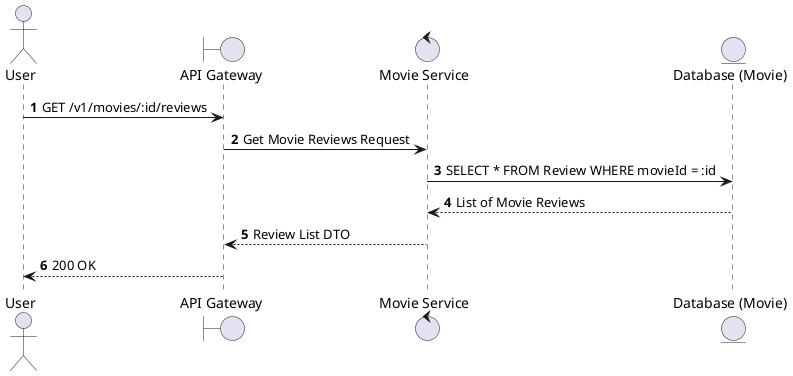
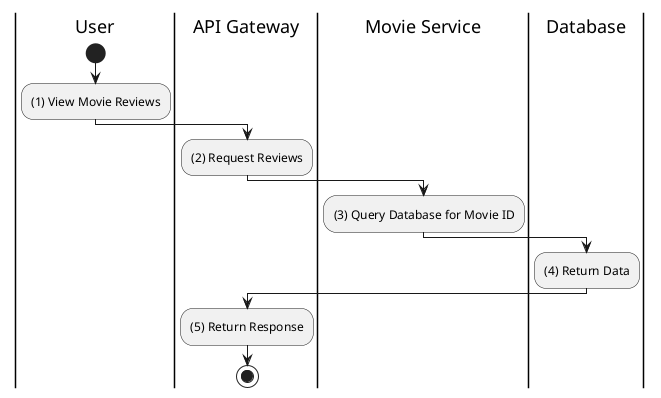

# [RV-02] Get Movie Reviews

## 1. Description

| Field | Details |
| :--- | :--- |
| **Name** | Get Movie Reviews |
| **Functional ID** | RV-02 |
| **Description** | Retrieves all reviews and ratings for a specific movie. |
| **Actor** | Guest, Member |
| **Trigger** | `GET /v1/movies/:id/reviews` |
| **Pre-condition** | Movie ID exists. |
| **Post-condition** | List of reviews for the movie returned. |

## 2. Sequence Flow

## 3. Activity Flow

## 4. Business Rules

| Activity Step | Rule ID | Description |
| :--- | :--- | :--- |
| (3) | N/A | Reviews should include user names (or obfuscated IDs) and rating values. |
