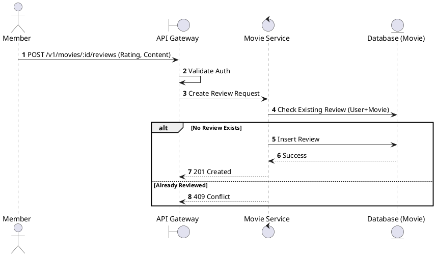
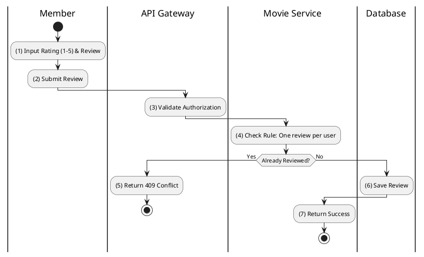

# [RV-03] Create Review

## 1. Description

| Field | Details |
| :--- | :--- |
| **Name** | Create Review |
| **Functional ID** | RV-03 |
| **Description** | Allows a Member to submit a review and rating for a movie they have (presumably) seen. |
| **Actor** | Member |
| **Trigger** | `POST /v1/movies/:id/reviews` |
| **Pre-condition** | Member authenticated; Movie ID exists; Member has not reviewed this movie yet. |
| **Post-condition** | Review created; Average movie rating updated (if calculated on fly). |

## 2. Sequence Flow

## 3. Activity Flow

## 4. Business Rules

| Activity Step | Rule ID | Description |
| :--- | :--- | :--- |
| (4) | BR-REVIEW-01 | One user can only submit one review per movie. |
| (1) | BR-REVIEW-02 | Rating scale: 1 to 5. |
