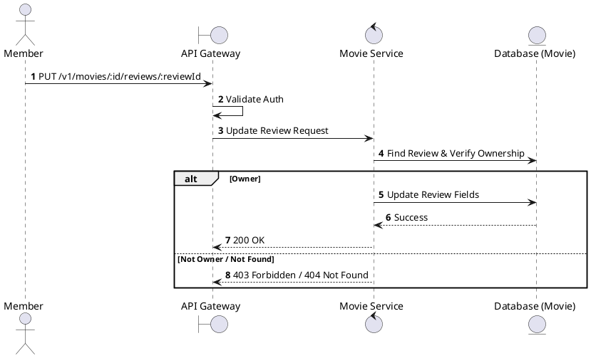
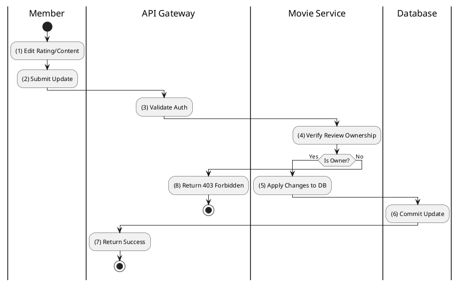

# [RV-04] Update Review

## 1. Description

| Field | Details |
| :--- | :--- |
| **Name** | Update Review |
| **Functional ID** | RV-04 |
| **Description** | Allows a Member to modify their own review and rating for a movie. |
| **Actor** | Member |
| **Trigger** | `PUT /v1/movies/:id/reviews/:reviewId` |
| **Pre-condition** | Member authenticated; Review ID exists and belongs to the Member. |
| **Post-condition** | Review record updated. |

## 2. Sequence Flow

## 3. Activity Flow

## 4. Business Rules

| Activity Step | Rule ID | Description |
| :--- | :--- | :--- |
| (4) | General | Users can only update reviews they created themselves. |
| (5) | BR-REVIEW-02 | New rating must be between 1 and 5. |
