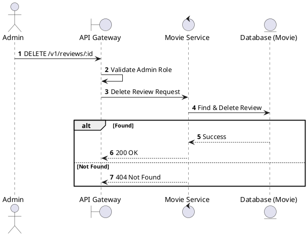
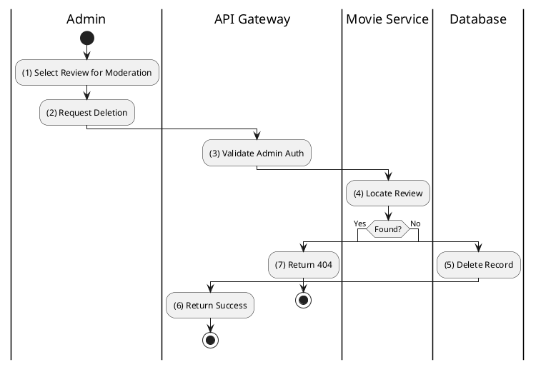

# [RV-05] Delete Review

## 1. Description

| Field | Details |
| :--- | :--- |
| **Name** | Delete Review |
| **Functional ID** | RV-05 |
| **Description** | Allows an Administrator to delete a review (e.g., for moderation). Note: SRS also allows Members to delete their own, but trigger is usually Admin-focused in list. |
| **Actor** | Admin |
| **Trigger** | `DELETE /v1/reviews/:id` |
| **Pre-condition** | Admin authenticated; Review ID exists. |
| **Post-condition** | Review record removed. |

## 2. Sequence Flow

## 3. Activity Flow

## 4. Business Rules

| Activity Step | Rule ID | Description |
| :--- | :--- | :--- |
| (5) | General | Deleted reviews should also trigger a recalculation of the movie's aggregate rating. |
