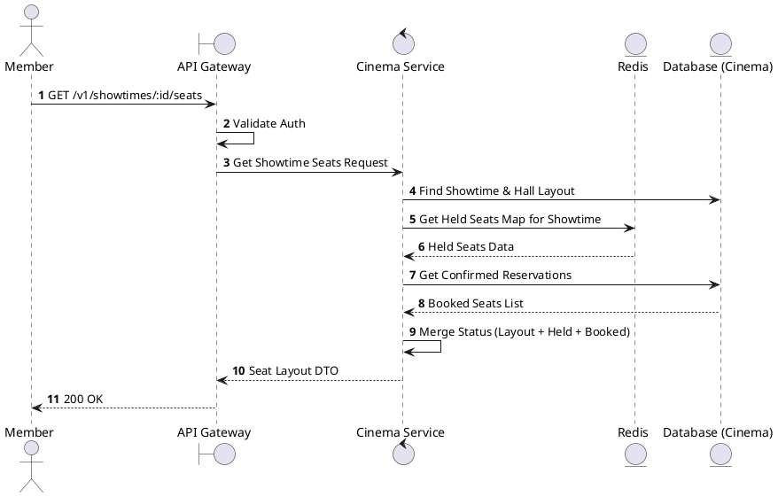
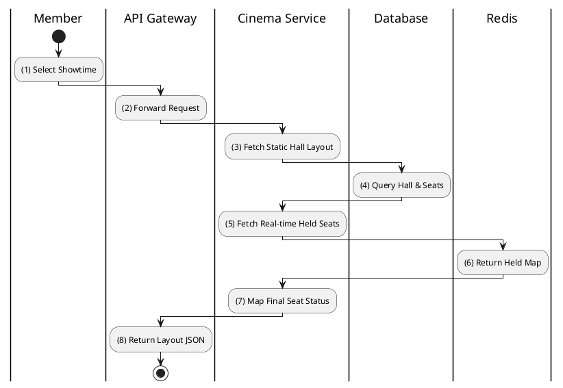

# [ST-01] Get Showtime Seats

## 1. Description

| Field | Details |
| :--- | :--- |
| **Name** | Get Showtime Seats |
| **Functional ID** | ST-01 |
| **Description** | Retrieves the current seat layout for a specific showtime, including real-time availability and held status for the requesting user. |
| **Actor** | Member |
| **Trigger** | `GET /v1/showtimes/:id/seats` |
| **Pre-condition** | Member is authenticated; Showtime ID exists. |
| **Post-condition** | Returns seat matrix with status (Available, Held, Booked, Broken). |

## 2. Sequence Flow

## 3. Activity Flow

## 4. Business Rules

| Activity Step | Rule ID | Description |
| :--- | :--- | :--- |
| (5) | BR-SEAT-04 | A seat cannot be held if it is already held by another user. |
| (7) | SRS 5.2 | Seat types (VIP/Standard) determine the base price displayed on UI. |
