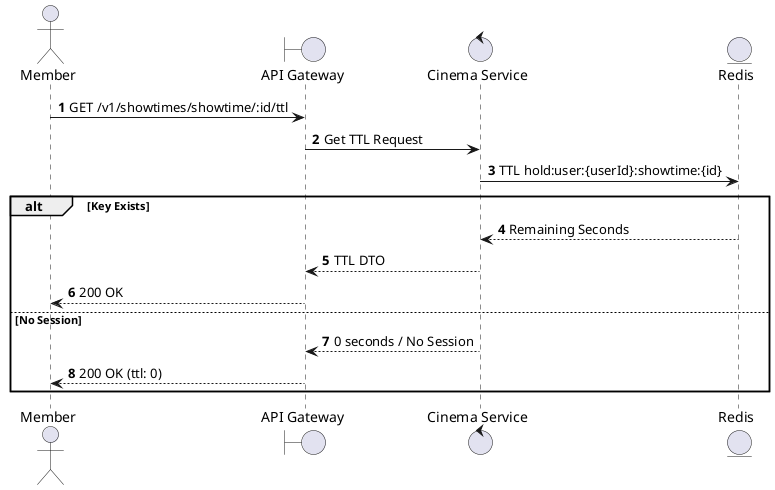
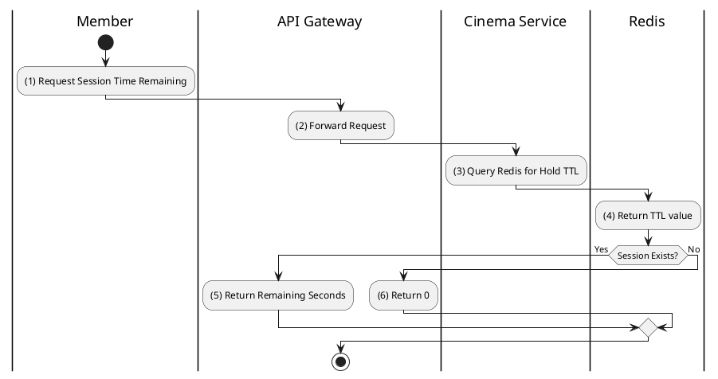

# [ST-02] Get Session TTL

## 1. Description

| Field | Details |
| :--- | :--- |
| **Name** | Get Session TTL |
| **Functional ID** | ST-02 |
| **Description** | Retrieves the remaining time (Time To Live) for the user's current seat-holding session for a showtime. |
| **Actor** | Member |
| **Trigger** | `GET /v1/showtimes/showtime/:showtimeId/ttl` |
| **Pre-condition** | Member has at least one seat held for this showtime. |
| **Post-condition** | Remaining seconds returned. |

## 2. Sequence Flow

## 3. Activity Flow

## 4. Business Rules

| Activity Step | Rule ID | Description |
| :--- | :--- | :--- |
| (3) | BR-SEAT-02 | Seat hold duration (TTL): 10 minutes (600 seconds). |
