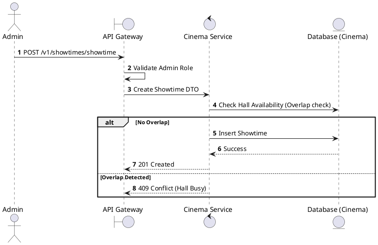
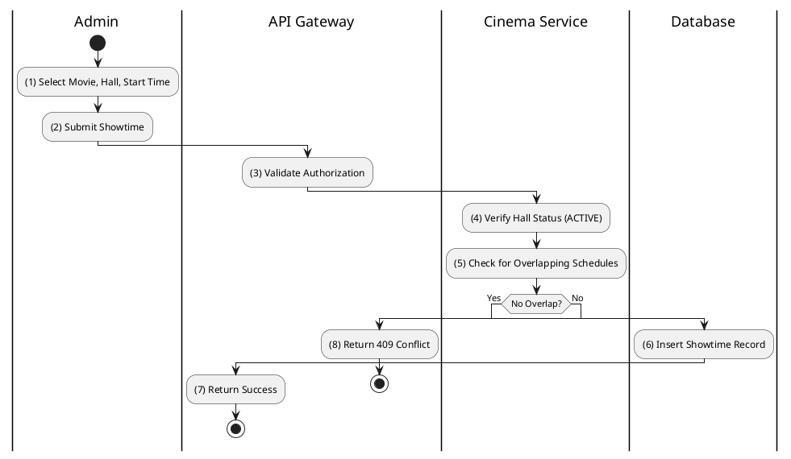

# [ST-03] Create Showtime

## 1. Description

| Field | Details |
| :--- | :--- |
| **Name** | Create Showtime |
| **Functional ID** | ST-03 |
| **Description** | Allows an Admin to schedule a single movie screening in a specific hall at a specific time. |
| **Actor** | Admin |
| **Trigger** | `POST /v1/showtimes/showtime` |
| **Pre-condition** | Admin authenticated; Movie, Hall, and Release IDs exist; No time overlap in the same hall. |
| **Post-condition** | New Showtime created. |

## 2. Sequence Flow

## 3. Activity Flow

## 4. Business Rules

| Activity Step | Rule ID | Description |
| :--- | :--- | :--- |
| (5) | General | A hall cannot have two showtimes that overlap in time (including a buffer for cleaning). |
| (4) | SRS 5.2 | Showtime status defaults to `SCHEDULED` or `SELLING`. |
