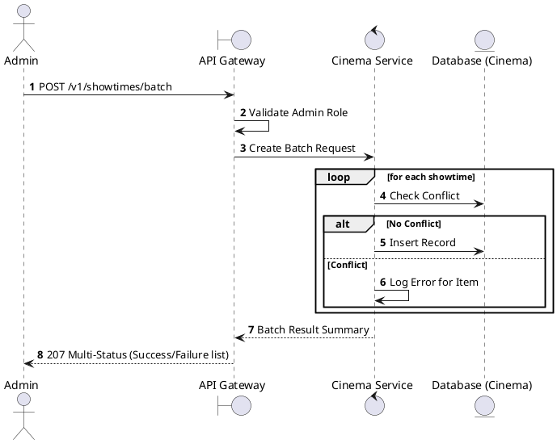
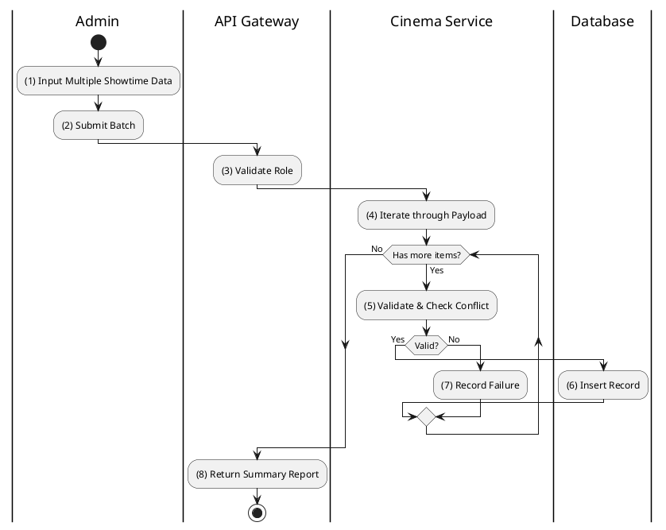

# [ST-04] Create Batch Showtimes

## 1. Description

| Field | Details |
| :--- | :--- |
| **Name** | Create Batch Showtimes |
| **Functional ID** | ST-04 |
| **Description** | Allows an Admin to create multiple showtimes at once (e.g., for an entire week) using a template or list of times. |
| **Actor** | Admin |
| **Trigger** | `POST /v1/showtimes/batch` |
| **Pre-condition** | Admin authenticated; Valid list of showtime payloads. |
| **Post-condition** | Multiple showtimes created; Any conflicting entries are reported. |

## 2. Sequence Flow

## 3. Activity Flow

## 4. Business Rules

| Activity Step | Rule ID | Description |
| :--- | :--- | :--- |
| (5) | General | Batch processing must handle partial successes (Atomic per record). |
| (5) | General | Conflict rules from ST-03 apply to each item. |
