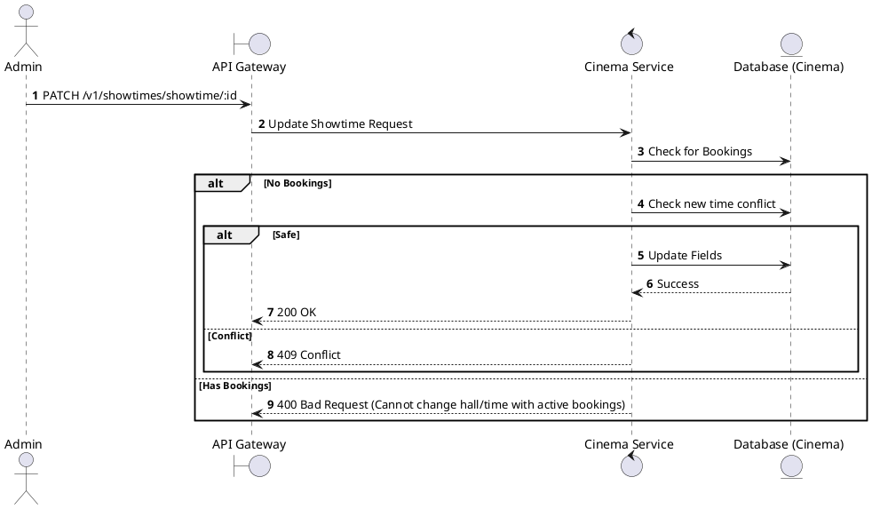
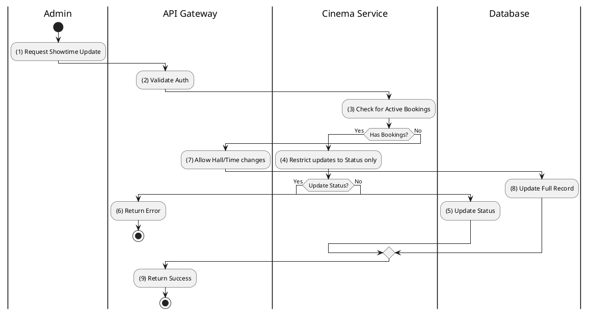

# [ST-05] Update Showtime

## 1. Description

| Field | Details |
| :--- | :--- |
| **Name** | Update Showtime |
| **Functional ID** | ST-05 |
| **Description** | Modifies an existing showtime's details (e.g., changing the hall, start time, or status). |
| **Actor** | Admin |
| **Trigger** | `PATCH /v1/showtimes/showtime/:id` |
| **Pre-condition** | Admin authenticated; Showtime exists; No bookings yet if changing time/hall. |
| **Post-condition** | Showtime record updated. |

## 2. Sequence Flow

## 3. Activity Flow

## 4. Business Rules

| Activity Step | Rule ID | Description |
| :--- | :--- | :--- |
| (3) | General | Changing Hall or Start Time is strictly prohibited if users have already booked tickets for that showtime. |
| (5) | SRS 5.2 | Valid statuses: `SCHEDULED`, `SELLING`, `SOLD_OUT`, `CANCELLED`, `COMPLETED`. |
