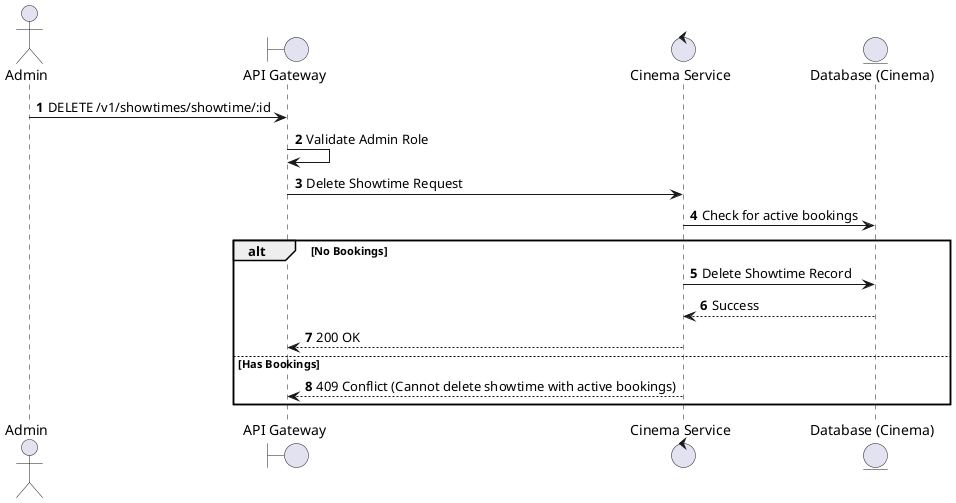
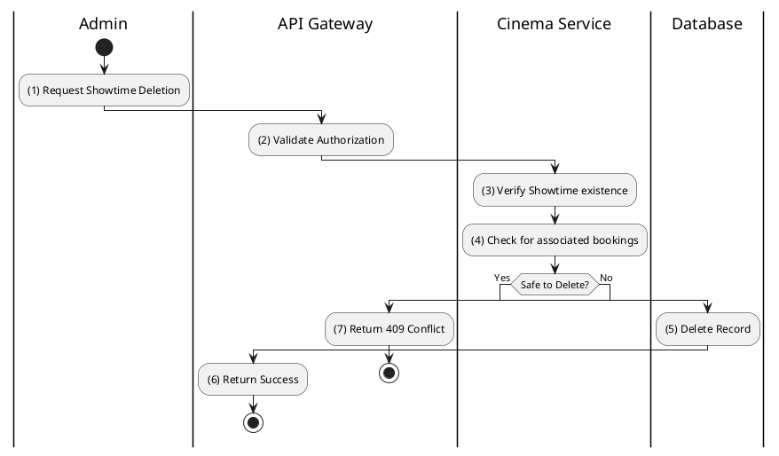

# [ST-06] Delete Showtime

## 1. Description

| Field | Details |
| :--- | :--- |
| **Name** | Delete Showtime |
| **Functional ID** | ST-06 |
| **Description** | Removes a scheduled showtime from the system. |
| **Actor** | Admin |
| **Trigger** | `DELETE /v1/showtimes/showtime/:id` |
| **Pre-condition** | Admin authenticated; Showtime ID exists; No bookings associated with the showtime. |
| **Post-condition** | Showtime record deleted from database. |

## 2. Sequence Flow

## 3. Activity Flow

## 4. Business Rules

| Activity Step | Rule ID | Description |
| :--- | :--- | :--- |
| (4) | General | Showtimes with confirmed or pending bookings cannot be physically deleted. They should be cancelled instead. |
