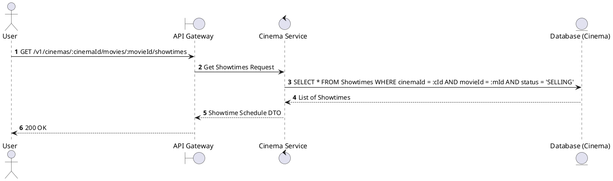
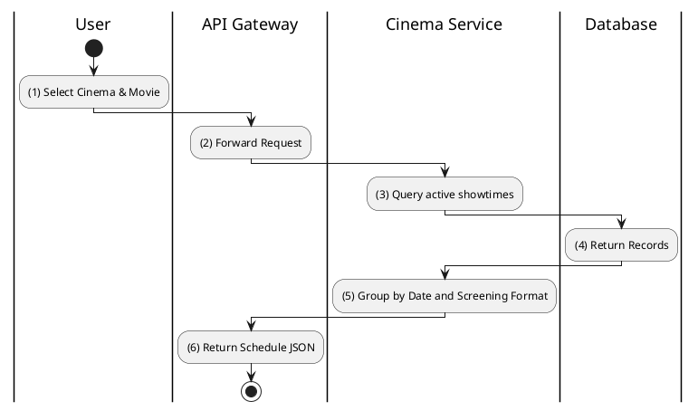

# [ST-07] Get Movie Showtimes at Cinema

## 1. Description

| Field | Details |
| :--- | :--- |
| **Name** | Get Movie Showtimes at Cinema |
| **Functional ID** | ST-07 |
| **Description** | Retrieves all available showtimes for a specific movie at a specific cinema location. |
| **Actor** | Guest, Member |
| **Trigger** | `GET /v1/cinemas/:cinemaId/movies/:movieId/showtimes` |
| **Pre-condition** | Cinema ID and Movie ID exist. |
| **Post-condition** | List of showtimes (grouped by date/format) returned. |

## 2. Sequence Flow

## 3. Activity Flow

## 4. Business Rules

| Activity Step | Rule ID | Description |
| :--- | :--- | :--- |
| (3) | SRS 5.2 | Only showtimes with status `SELLING` or `SCHEDULED` are returned to the public. |
| (5) | SRS 5.2 | Results are categorized by format (2D, 3D, IMAX) for better user experience. |
