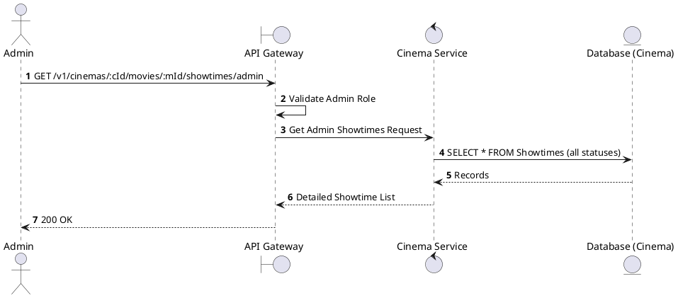
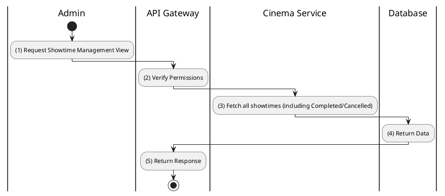

# [ST-08] Admin Get Showtimes

## 1. Description

| Field | Details |
| :--- | :--- |
| **Name** | Admin Get Showtimes |
| **Functional ID** | ST-08 |
| **Description** | Provides an administrative view of showtimes for a movie at a cinema, including internal status and capacity info. |
| **Actor** | Admin |
| **Trigger** | `GET /v1/cinemas/:cinemaId/movies/:movieId/showtimes/admin` |
| **Pre-condition** | Admin authenticated. |
| **Post-condition** | Detailed list of showtimes returned. |

## 2. Sequence Flow

## 3. Activity Flow

## 4. Business Rules

| Activity Step | Rule ID | Description |
| :--- | :--- | :--- |
| (3) | N/A | Unlike public views, this includes `CANCELLED` and `COMPLETED` showtimes for auditing. |
| (3) | N/A | Includes booking counts or seat occupancy percentages. |
