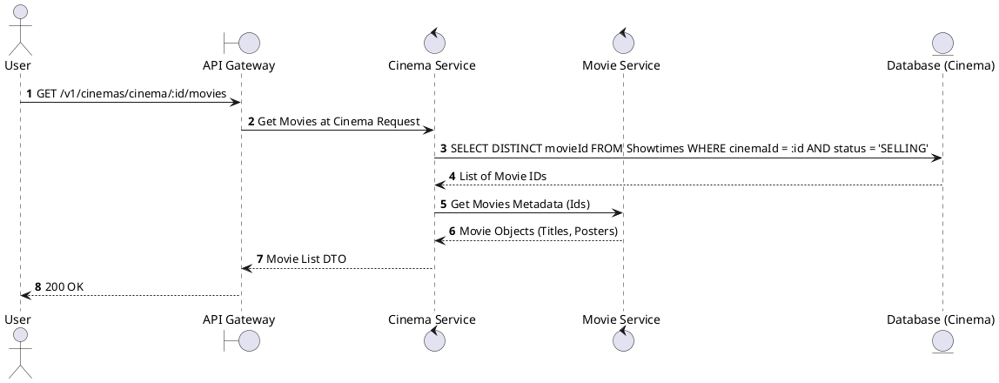
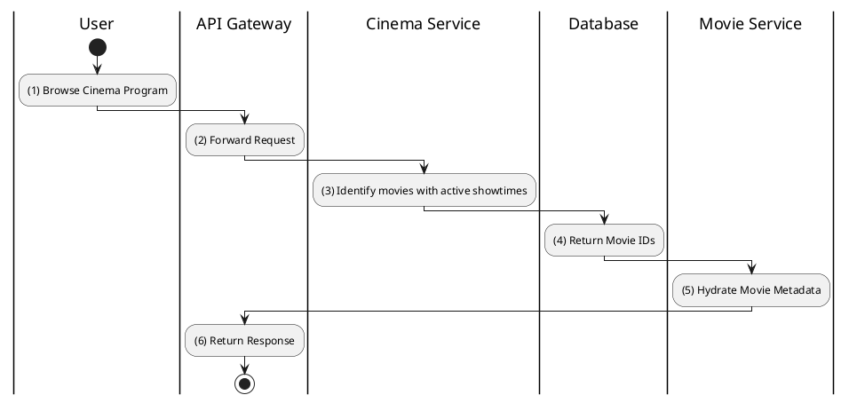

# [ST-09] Get Movies at Cinema

## 1. Description

| Field | Details |
| :--- | :--- |
| **Name** | Get Movies at Cinema |
| **Functional ID** | ST-09 |
| **Description** | Lists all movies that currently have scheduled showtimes at a specific cinema location. |
| **Actor** | Guest, Member |
| **Trigger** | `GET /v1/cinemas/cinema/:cinemaId/movies` |
| **Pre-condition** | Cinema ID exists. |
| **Post-condition** | List of movies with active showtimes returned. |

## 2. Sequence Flow

## 3. Activity Flow

## 4. Business Rules

| Activity Step | Rule ID | Description |
| :--- | :--- | :--- |
| (3) | SRS 5.2 | Only movies with at least one showtime in `SELLING` status are included. |
