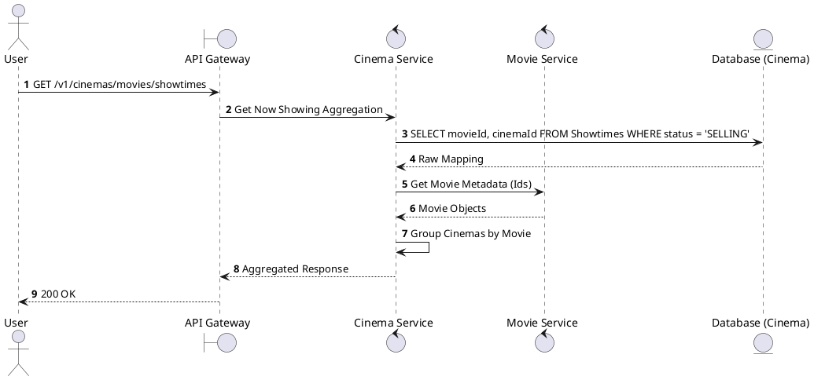
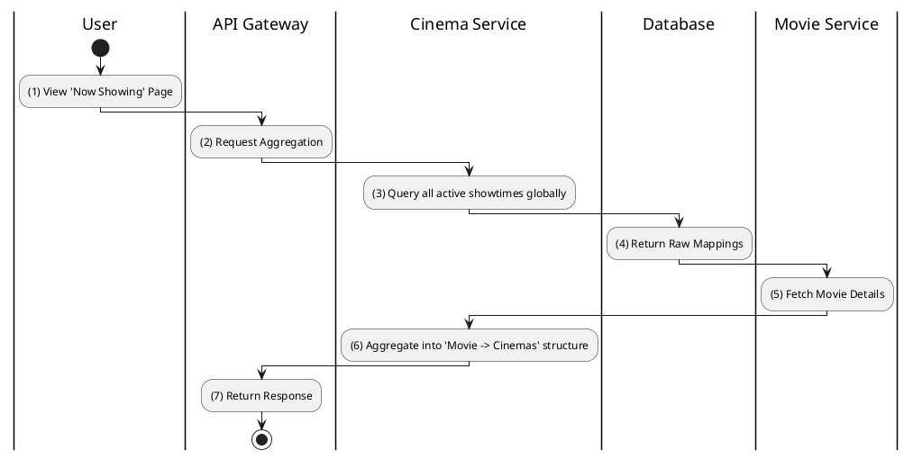

# [ST-10] Get All Movies with Showtimes

## 1. Description

| Field | Details |
| :--- | :--- |
| **Name** | Get All Movies with Showtimes |
| **Functional ID** | ST-10 |
| **Description** | Aggregates all movies across the platform that currently have active showtimes, often used for a "Now Showing" landing page. |
| **Actor** | Guest, Member |
| **Trigger** | `GET /v1/cinemas/movies/showtimes` |
| **Pre-condition** | None. |
| **Post-condition** | Aggregated list of movies with their associated cinemas/times. |

## 2. Sequence Flow

## 3. Activity Flow

## 4. Business Rules

| Activity Step | Rule ID | Description |
| :--- | :--- | :--- |
| (3) | SRS 5.2 | Filters out movies that have no available showtimes left for the day. |
| (6) | N/A | Typically sorted by movie popularity or release date. |
