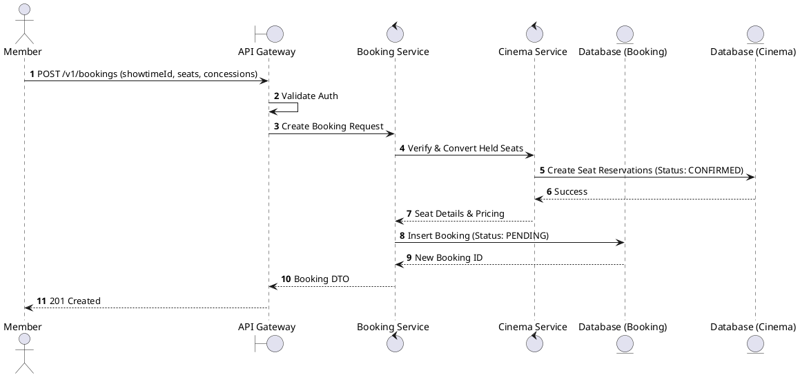
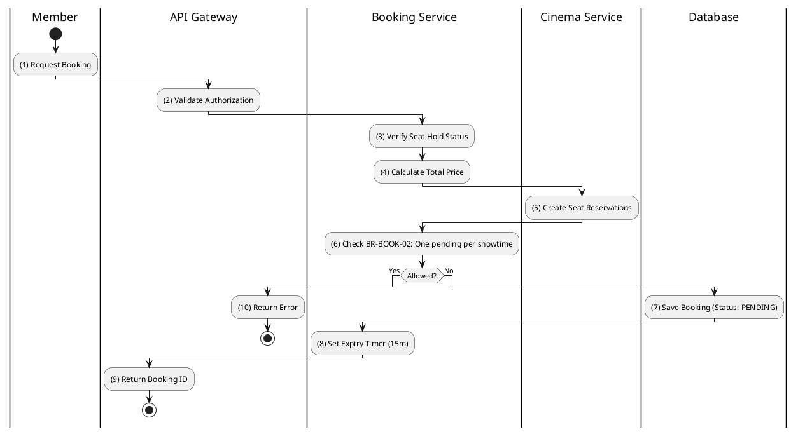

# [BK-01] Create Booking

## 1. Description

| Field | Details |
| :--- | :--- |
| **Name** | Create Booking |
| **Functional ID** | BK-01 |
| **Description** | Initiates a new booking for a specific showtime and set of held seats. |
| **Actor** | Member |
| **Trigger** | `POST /v1/bookings` |
| **Pre-condition** | Member authenticated; Seats held in Redis; Showtime is active. |
| **Post-condition** | Booking created with status `PENDING`; Expiry timer started. |

## 2. Sequence Flow

## 3. Activity Flow

## 4. Business Rules

| Activity Step | Rule ID | Description |
| :--- | :--- | :--- |
| (8) | BR-BOOK-01 | Booking expiry time: 15 minutes from creation. |
| (6) | BR-BOOK-02 | Only one pending booking per user per showtime is allowed. |
| (4) | BR-PAY-03 | VAT rate: 10% on all transactions. |
