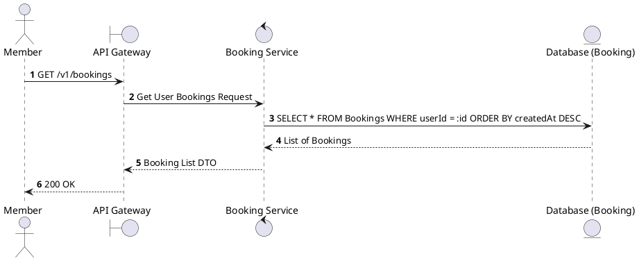
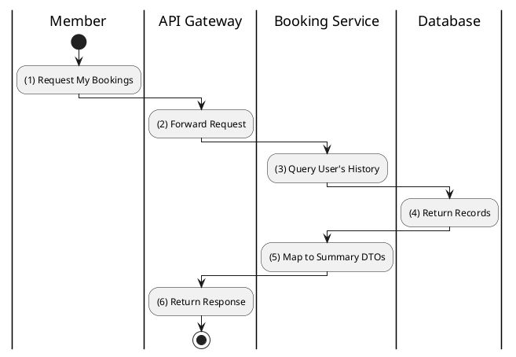

# [BK-02] List User Bookings

## 1. Description

| Field | Details |
| :--- | :--- |
| **Name** | List User Bookings |
| **Functional ID** | BK-02 |
| **Description** | Retrieves the booking history for the authenticated member. |
| **Actor** | Member |
| **Trigger** | `GET /v1/bookings` |
| **Pre-condition** | Member authenticated. |
| **Post-condition** | List of user's bookings returned. |

## 2. Sequence Flow

## 3. Activity Flow

## 4. Business Rules

| Activity Step | Rule ID | Description |
| :--- | :--- | :--- |
| (3) | N/A | Only returns bookings belonging to the requesting user. |
