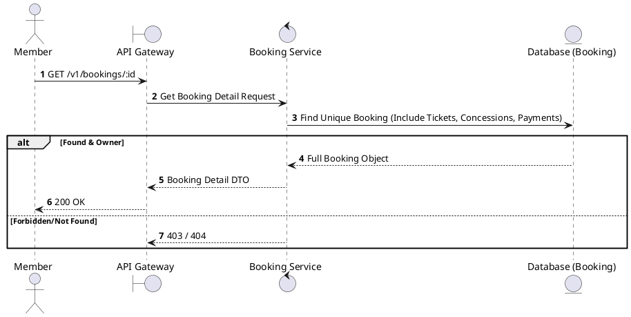
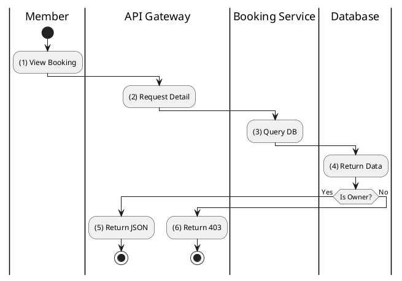

# [BK-03] Get Booking Details

## 1. Description

| Field | Details |
| :--- | :--- |
| **Name** | Get Booking Details |
| **Functional ID** | BK-03 |
| **Description** | Retrieves full details of a specific booking, including tickets, concessions, and payment status. |
| **Actor** | Member |
| **Trigger** | `GET /v1/bookings/:id` |
| **Pre-condition** | Member authenticated; Booking ID exists and belongs to the member. |
| **Post-condition** | Full booking object returned. |

## 2. Sequence Flow

## 3. Activity Flow

## 4. Business Rules

| Activity Step | Rule ID | Description |
| :--- | :--- | :--- |
| (3) | N/A | Includes QR code data for tickets if status is CONFIRMED. |
| (3) | SRS 5.1 | Hydrates data for Bookings, Tickets, Payments, and BookingConcessions. |
