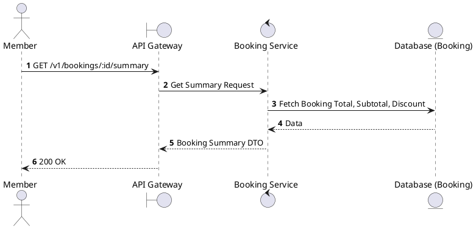
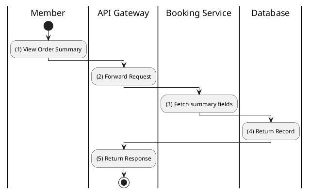

# [BK-04] Get Booking Summary

## 1. Description

| Field | Details |
| :--- | :--- |
| **Name** | Get Booking Summary |
| **Functional ID** | BK-04 |
| **Description** | Provides a lightweight summary of a booking, typically used for order confirmation screens before final payment. |
| **Actor** | Member |
| **Trigger** | `GET /v1/bookings/:id/summary` |
| **Pre-condition** | Booking exists. |
| **Post-condition** | Summary info returned. |

## 2. Sequence Flow

## 3. Activity Flow

## 4. Business Rules

| Activity Step | Rule ID | Description |
| :--- | :--- | :--- |
| (3) | N/A | Excludes internal technical fields and full QR data. |
