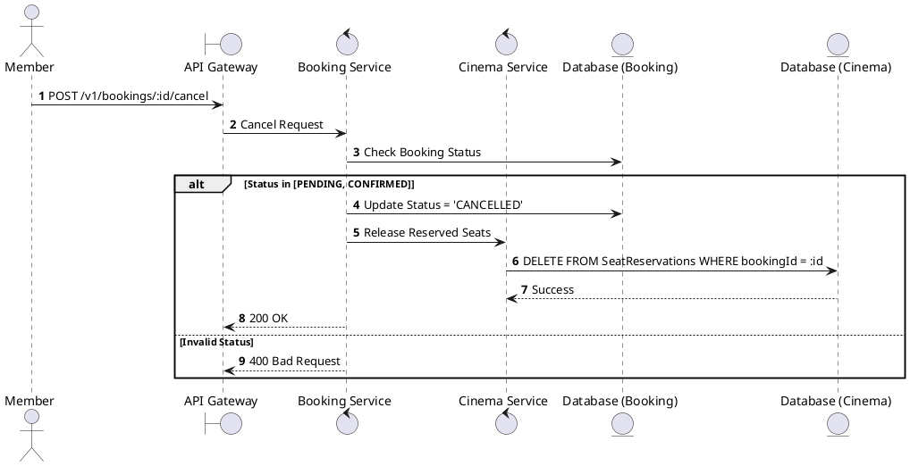
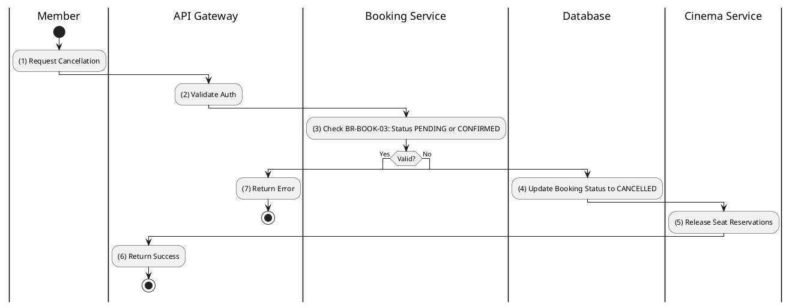

# [BK-05] Cancel Booking

## 1. Description

| Field | Details |
| :--- | :--- |
| **Name** | Cancel Booking |
| **Functional ID** | BK-05 |
| **Description** | Cancels a PENDING booking before payment or a CONFIRMED booking (without refund logic here, see BK-09 for refund). |
| **Actor** | Member |
| **Trigger** | `POST /v1/bookings/:id/cancel` |
| **Pre-condition** | Booking belongs to Member; Status is PENDING or CONFIRMED. |
| **Post-condition** | Booking status set to `CANCELLED`; Seats released. |

## 2. Sequence Flow

## 3. Activity Flow

## 4. Business Rules

| Activity Step | Rule ID | Description |
| :--- | :--- | :--- |
| (3) | BR-BOOK-03 | Bookings can only be cancelled when status is PENDING or CONFIRMED. |
| (5) | N/A | Seats are made available for other users immediately after cancellation. |
