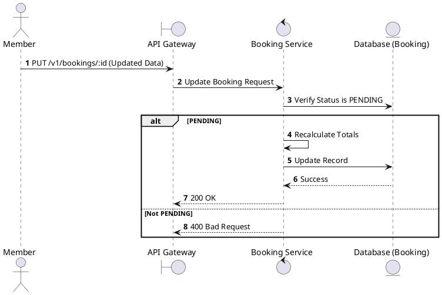
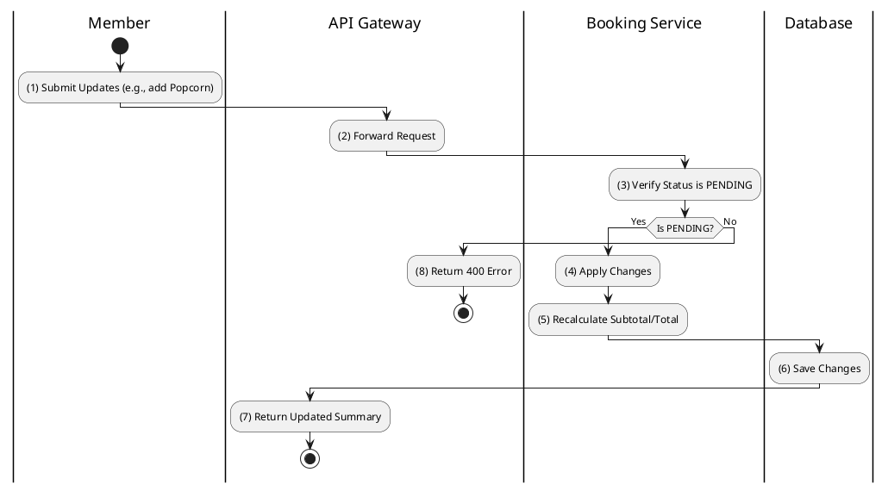

# [BK-06] Update Booking

## 1. Description

| Field | Details |
| :--- | :--- |
| **Name** | Update Booking |
| **Functional ID** | BK-06 |
| **Description** | Allows updating booking details (e.g., adding concessions or applying a promotion) while in PENDING status. |
| **Actor** | Member |
| **Trigger** | `PUT /v1/bookings/:id` |
| **Pre-condition** | Booking belongs to Member; Status is PENDING. |
| **Post-condition** | Booking updated; Total price recalculated. |

## 2. Sequence Flow

## 3. Activity Flow

## 4. Business Rules

| Activity Step | Rule ID | Description |
| :--- | :--- | :--- |
| (3) | N/A | Bookings cannot be modified once they are CONFIRMED or PAID. |
| (5) | BR-PAY-03 | VAT (10%) must be recalculated based on new items. |
