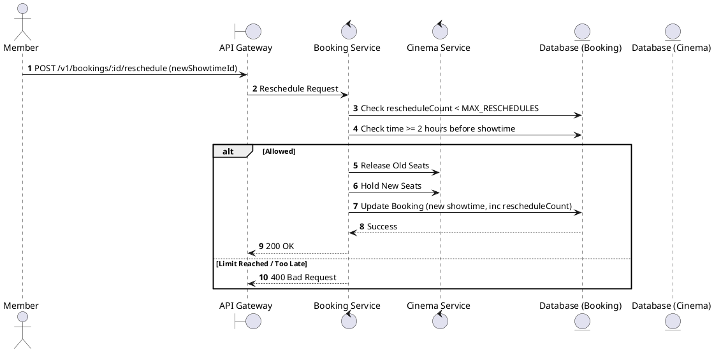
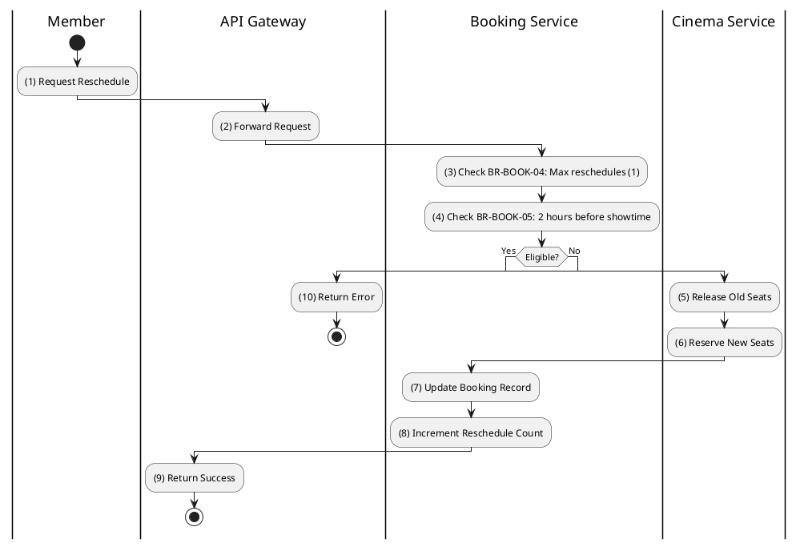

# [BK-07] Reschedule Booking

## 1. Description

| Field | Details |
| :--- | :--- |
| **Name** | Reschedule Booking |
| **Functional ID** | BK-07 |
| **Description** | Allows a Member to change the showtime of an existing CONFIRMED booking, subject to limits and time constraints. |
| **Actor** | Member |
| **Trigger** | `POST /v1/bookings/:id/reschedule` |
| **Pre-condition** | Booking status is CONFIRMED; New showtime exists; At least 2 hours before original showtime. |
| **Post-condition** | Original booking cancelled; New booking created or updated; Reschedule count incremented. |

## 2. Sequence Flow

## 3. Activity Flow

## 4. Business Rules

| Activity Step | Rule ID | Description |
| :--- | :--- | :--- |
| (3) | BR-BOOK-04 | Maximum reschedules per booking: 1. |
| (4) | BR-BOOK-05 | Rescheduling must be made at least 2 hours before showtime. |
| (7) | N/A | Total price may need adjustment if new showtime has different pricing. |
