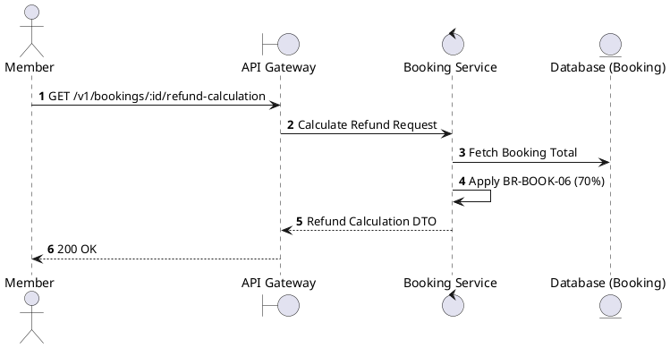
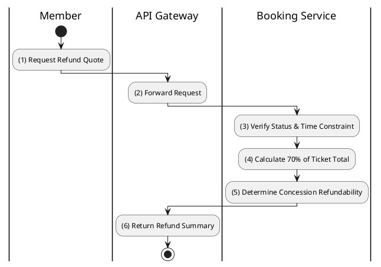

# [BK-08] Calculate Refund

## 1. Description

| Field | Details |
| :--- | :--- |
| **Name** | Calculate Refund |
| **Functional ID** | BK-08 |
| **Description** | Calculates the potential refund amount for a booking cancellation based on business rules. |
| **Actor** | Member |
| **Trigger** | `GET /v1/bookings/:id/refund-calculation` |
| **Pre-condition** | Booking exists and is CONFIRMED. |
| **Post-condition** | Potential refund amount and breakdown returned. |

## 2. Sequence Flow

## 3. Activity Flow

## 4. Business Rules

| Activity Step | Rule ID | Description |
| :--- | :--- | :--- |
| (4) | BR-BOOK-06 | Refund percentage on ticket cancellation: 70%. |
| (3) | BR-BOOK-05 | Refund eligibility requires cancellation at least 2 hours before showtime. |
