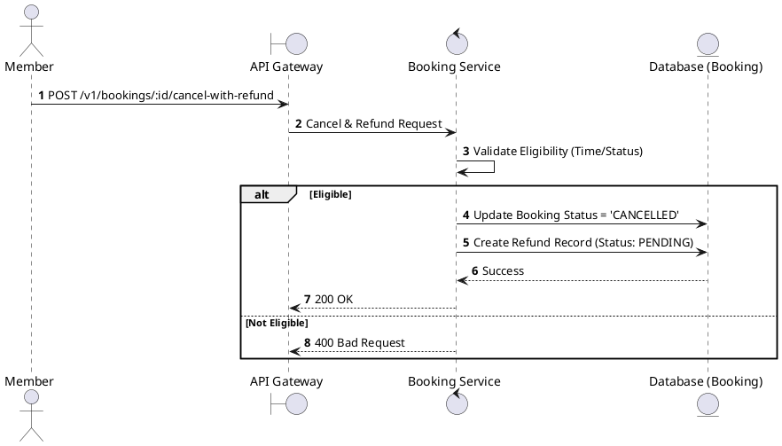
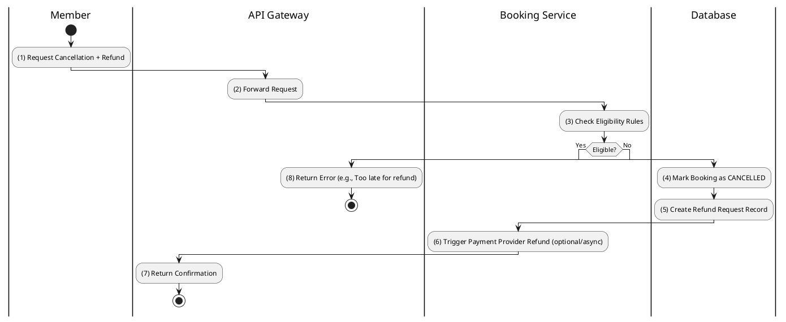

# [BK-09] Cancel with Refund

## 1. Description

| Field | Details |
| :--- | :--- |
| **Name** | Cancel with Refund |
| **Functional ID** | BK-09 |
| **Description** | Processes a cancellation and initiates a refund request in one operation. |
| **Actor** | Member |
| **Trigger** | `POST /v1/bookings/:id/cancel-with-refund` |
| **Pre-condition** | Member authenticated; Booking eligible for refund. |
| **Post-condition** | Booking status `CANCELLED`; Refund record created with status `PENDING`. |

## 2. Sequence Flow

## 3. Activity Flow

## 4. Business Rules

| Activity Step | Rule ID | Description |
| :--- | :--- | :--- |
| (3) | BR-BOOK-05 | Cancellation must be made at least 2 hours before showtime. |
| (3) | BR-BOOK-06 | Refund amount = 70% of ticket price. |
