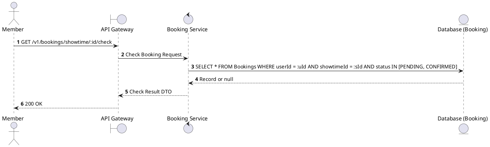
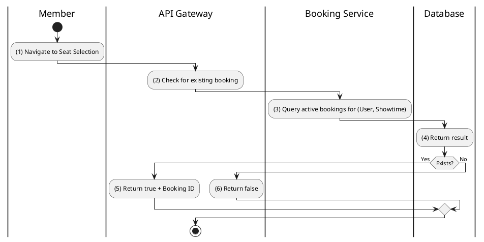

# [BK-10] Check User Booking at Showtime

## 1. Description

| Field | Details |
| :--- | :--- |
| **Name** | Check User Booking at Showtime |
| **Functional ID** | BK-10 |
| **Description** | Checks if the user already has a pending or confirmed booking for a specific showtime. |
| **Actor** | Member |
| **Trigger** | `GET /v1/bookings/showtime/:showtimeId/check` |
| **Pre-condition** | Member authenticated. |
| **Post-condition** | Boolean status and booking ID (if exists) returned. |

## 2. Sequence Flow

## 3. Activity Flow

## 4. Business Rules

| Activity Step | Rule ID | Description |
| :--- | :--- | :--- |
| (3) | BR-BOOK-02 | Prevents users from creating multiple active bookings for the same showtime. |
