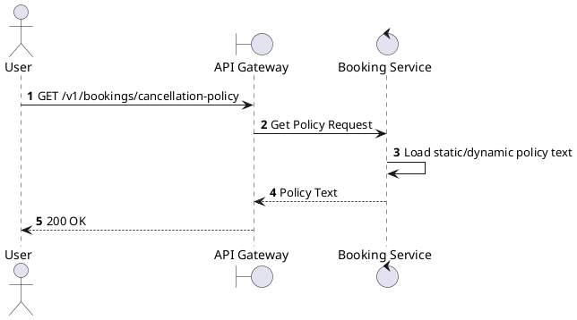
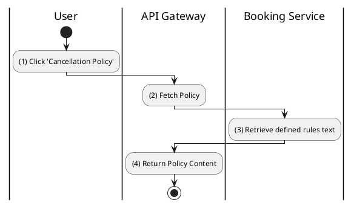

# [BK-11] Get Cancellation Policy

## 1. Description

| Field | Details |
| :--- | :--- |
| **Name** | Get Cancellation Policy |
| **Functional ID** | BK-11 |
| **Description** | Returns the human-readable text of the platform's cancellation and refund policy. |
| **Actor** | Guest, Member |
| **Trigger** | `GET /v1/bookings/cancellation-policy` |
| **Pre-condition** | None. |
| **Post-condition** | Policy text returned. |

## 2. Sequence Flow

## 3. Activity Flow

## 4. Business Rules

| Activity Step | Rule ID | Description |
| :--- | :--- | :--- |
| (3) | BR-BOOK-05 | Must mention the 2-hour deadline. |
| (3) | BR-BOOK-06 | Must mention the 70% refund rate. |
