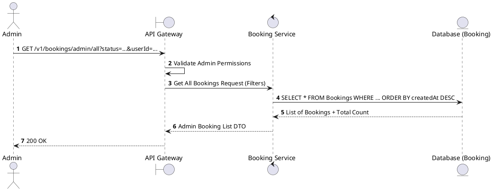
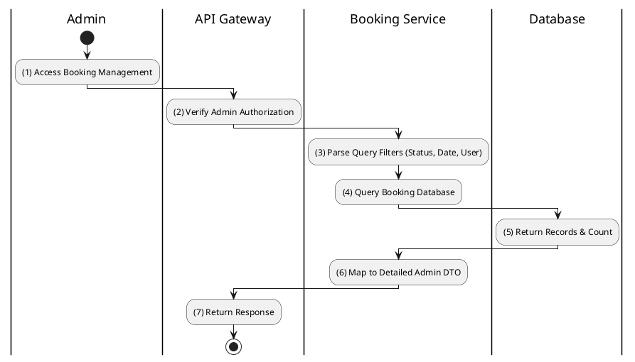

# [BK-A01] Admin List All Bookings

## 1. Description

| Field | Details |
| :--- | :--- |
| **Name** | Admin List All Bookings |
| **Functional ID** | BK-A01 |
| **Description** | Allows Administrators to view a comprehensive list of all bookings across the platform with filtering and sorting capabilities. |
| **Actor** | Admin |
| **Trigger** | `GET /v1/bookings/admin/all` |
| **Pre-condition** | Admin authenticated with proper permissions. |
| **Post-condition** | Paginated list of all bookings returned. |

## 2. Sequence Flow

## 3. Activity Flow

## 4. Business Rules

| Activity Step | Rule ID | Description |
| :--- | :--- | :--- |
| (2) | N/A | Restricted to Admin actor (SRS Section 2.1). |
| (6) | N/A | DTO includes sensitive user info and full transaction history not visible to members. |
