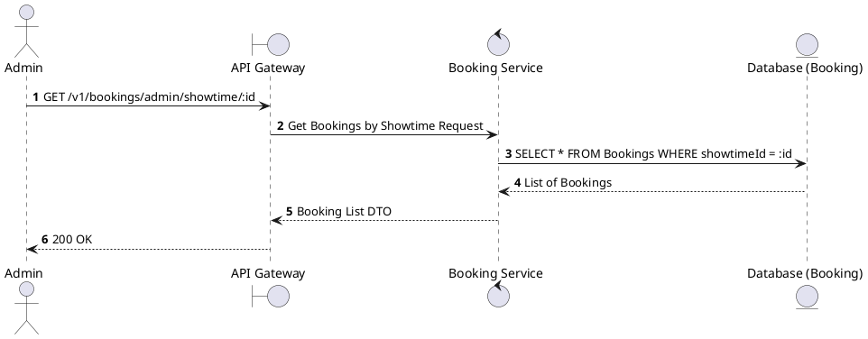
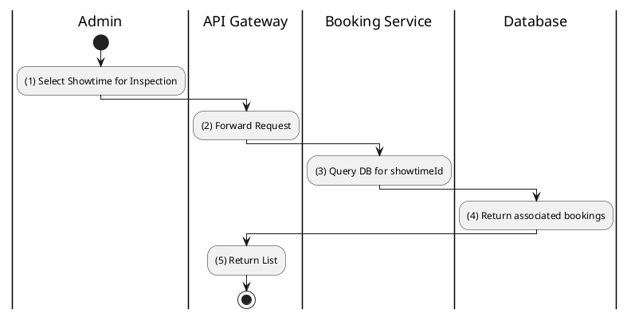

# [BK-A02] Find Bookings by Showtime

## 1. Description

| Field | Details |
| :--- | :--- |
| **Name** | Find Bookings by Showtime |
| **Functional ID** | BK-A02 |
| **Description** | Allows an Admin to view all bookings associated with a specific showtime. |
| **Actor** | Admin |
| **Trigger** | `GET /v1/bookings/admin/showtime/:showtimeId` |
| **Pre-condition** | Admin authenticated; Showtime ID exists. |
| **Post-condition** | List of bookings for the showtime returned. |

## 2. Sequence Flow

## 3. Activity Flow

## 4. Business Rules

| Activity Step | Rule ID | Description |
| :--- | :--- | :--- |
| (3) | N/A | Useful for checking attendance or managing issues for a specific screening. |
