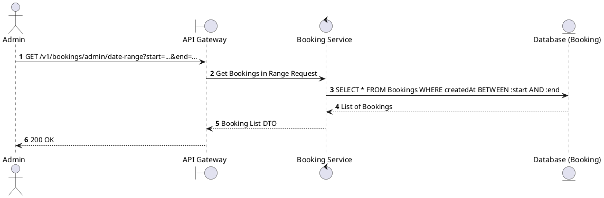
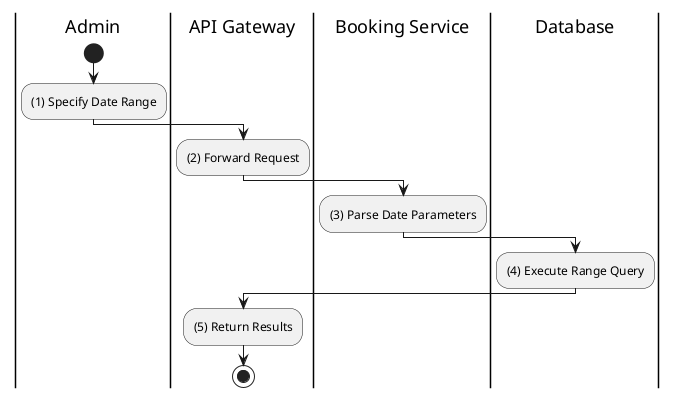

# [BK-A03] Find Bookings by Date Range

## 1. Description

| Field | Details |
| :--- | :--- |
| **Name** | Find Bookings by Date Range |
| **Functional ID** | BK-A03 |
| **Description** | Allows an Admin to filter bookings based on their creation date within a specified range. |
| **Actor** | Admin |
| **Trigger** | `GET /v1/bookings/admin/date-range` |
| **Pre-condition** | Admin authenticated; Valid start and end dates provided. |
| **Post-condition** | List of bookings within the date range returned. |

## 2. Sequence Flow

## 3. Activity Flow

## 4. Business Rules

| Activity Step | Rule ID | Description |
| :--- | :--- | :--- |
| (3) | N/A | Dates must be in ISO 8601 format or compatible. |
