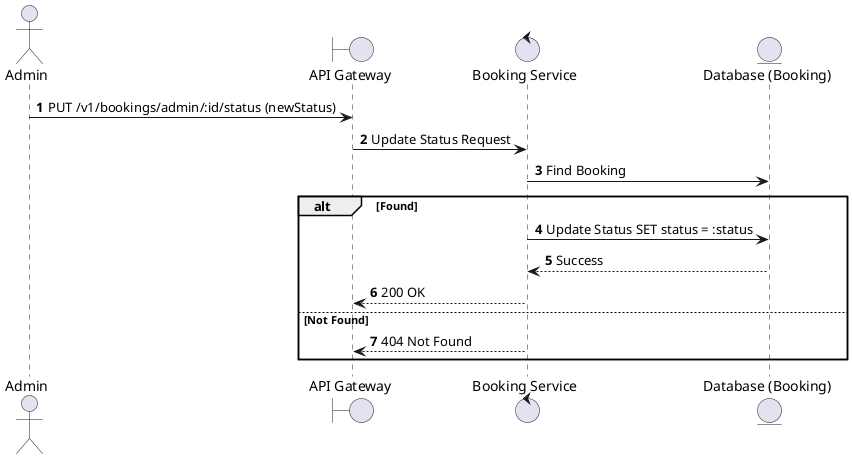
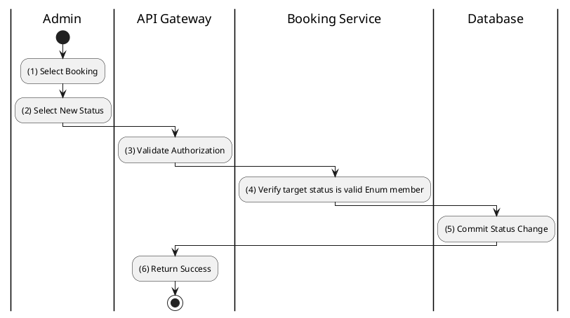

# [BK-A04] Update Booking Status

## 1. Description

| Field | Details |
| :--- | :--- |
| **Name** | Update Booking Status |
| **Functional ID** | BK-A04 |
| **Description** | Allows an Administrator to manually override the status of a booking (e.g., for troubleshooting or manual overrides). |
| **Actor** | Admin |
| **Trigger** | `PUT /v1/bookings/admin/:id/status` |
| **Pre-condition** | Admin authenticated; Booking exists; Target status is valid. |
| **Post-condition** | Booking status updated in database. |

## 2. Sequence Flow

## 3. Activity Flow

## 4. Business Rules

| Activity Step | Rule ID | Description |
| :--- | :--- | :--- |
| (4) | N/A | Target status must be a valid member of `BookingStatus` enum. |
| (5) | N/A | Changing status manually should be logged for auditing purposes. |
