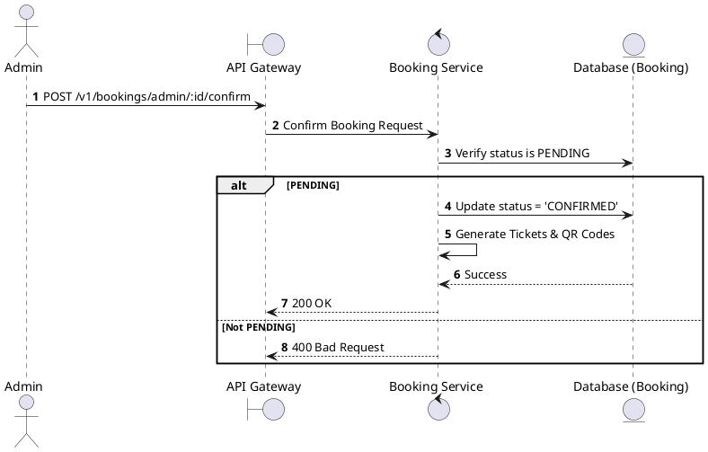
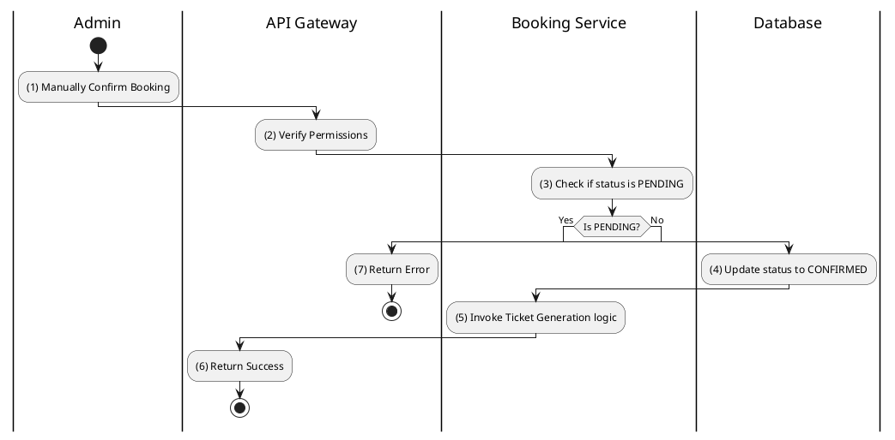

# [BK-A05] Confirm Booking

## 1. Description

| Field | Details |
| :--- | :--- |
| **Name** | Confirm Booking |
| **Functional ID** | BK-A05 |
| **Description** | Manually marks a PENDING booking as CONFIRMED, typically used when payment is verified outside the automated system. |
| **Actor** | Admin |
| **Trigger** | `POST /v1/bookings/admin/:id/confirm` |
| **Pre-condition** | Admin authenticated; Booking status is PENDING. |
| **Post-condition** | Booking status set to CONFIRMED; Tickets generated. |

## 2. Sequence Flow

## 3. Activity Flow

## 4. Business Rules

| Activity Step | Rule ID | Description |
| :--- | :--- | :--- |
| (4) | N/A | Confirming a booking manually bypasses the payment gateway IPN check. |
| (5) | N/A | Same ticket generation logic as automated flow (Section 3.7). |
