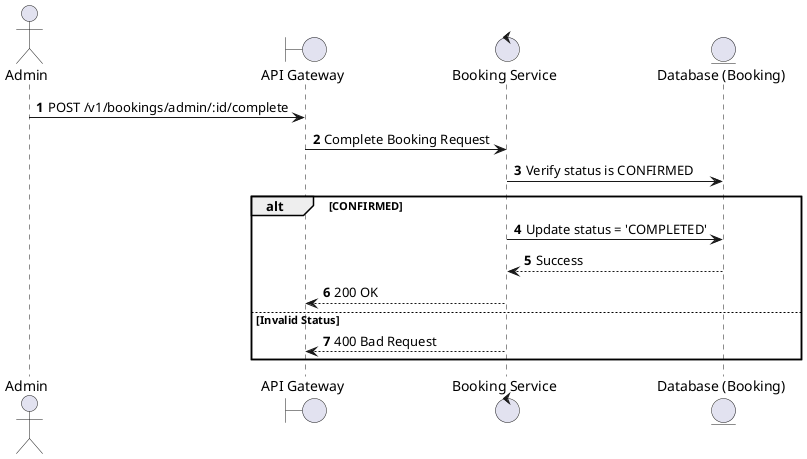
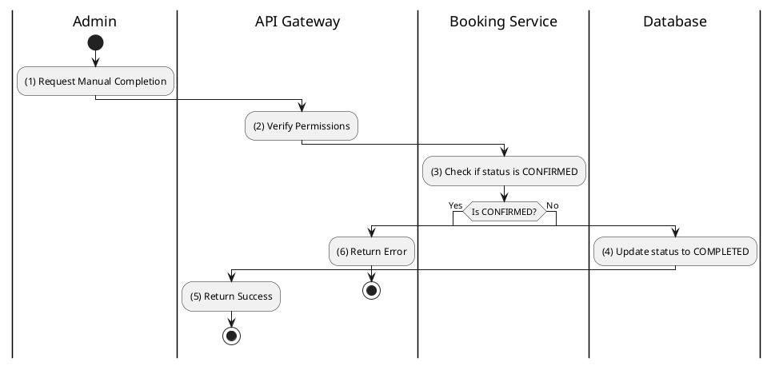

# [BK-A06] Complete Booking

## 1. Description

| Field | Details |
| :--- | :--- |
| **Name** | Complete Booking |
| **Functional ID** | BK-A06 |
| **Description** | Marks a CONFIRMED booking as COMPLETED. This usually happens automatically after the showtime ends or manually by an Admin. |
| **Actor** | Admin |
| **Trigger** | `POST /v1/bookings/admin/:id/complete` |
| **Pre-condition** | Admin authenticated; Booking status is CONFIRMED. |
| **Post-condition** | Booking status set to COMPLETED. |

## 2. Sequence Flow

## 3. Activity Flow

## 4. Business Rules

| Activity Step | Rule ID | Description |
| :--- | :--- | :--- |
| (4) | N/A | COMPLETED status indicates the service has been successfully rendered (user attended). |
