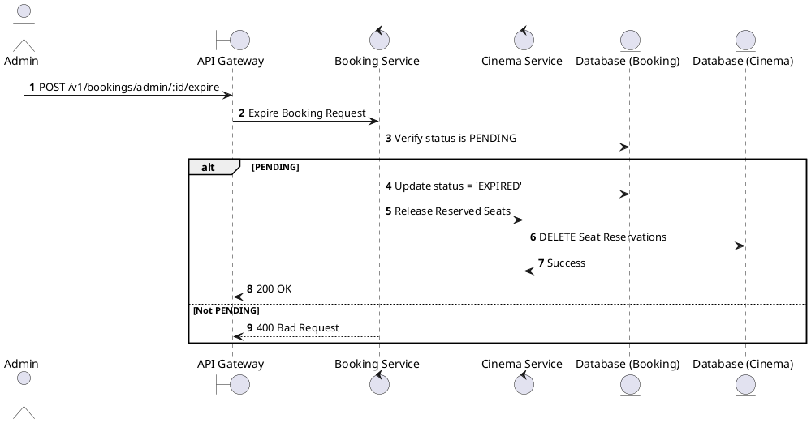
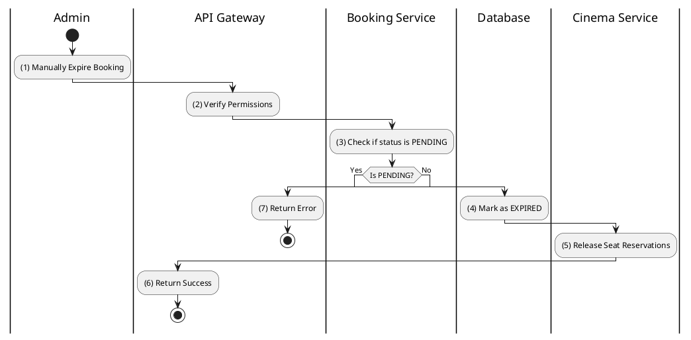

# [BK-A07] Expire Booking

## 1. Description

| Field | Details |
| :--- | :--- |
| **Name** | Expire Booking |
| **Functional ID** | BK-A07 |
| **Description** | Manually expires a PENDING booking that has exceeded its allowed payment time window. |
| **Actor** | Admin |
| **Trigger** | `POST /v1/bookings/admin/:id/expire` |
| **Pre-condition** | Admin authenticated; Booking status is PENDING. |
| **Post-condition** | Booking status set to EXPIRED; Seats released. |

## 2. Sequence Flow

## 3. Activity Flow

## 4. Business Rules

| Activity Step | Rule ID | Description |
| :--- | :--- | :--- |
| (3) | BR-BOOK-01 | Bookings usually expire automatically after 15 minutes, but Admin can trigger this manually for cleanup. |
| (5) | N/A | Seats must be released immediately to make them available for others. |
