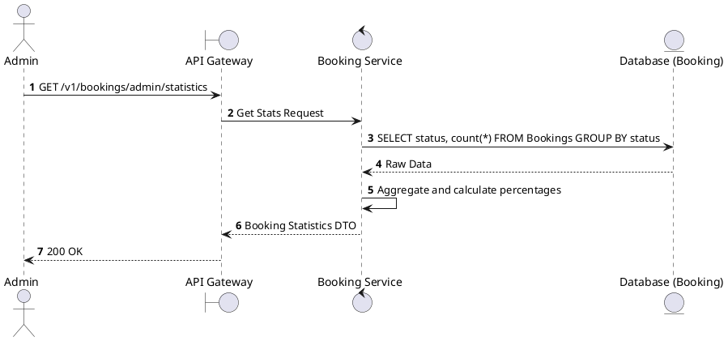
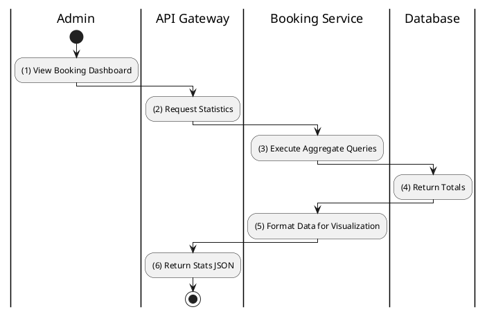

# [BK-A08] Get Booking Statistics

## 1. Description

| Field | Details |
| :--- | :--- |
| **Name** | Get Booking Statistics |
| **Functional ID** | BK-A08 |
| **Description** | Provides high-level statistics about bookings, such as total count by status, peak booking times, etc. |
| **Actor** | Admin |
| **Trigger** | `GET /v1/bookings/admin/statistics` |
| **Pre-condition** | Admin authenticated. |
| **Post-condition** | Statistical summary data returned. |

## 2. Sequence Flow

## 3. Activity Flow

## 4. Business Rules

| Activity Step | Rule ID | Description |
| :--- | :--- | :--- |
| (3) | N/A | Statistics help in identifying system performance and booking trends. |
