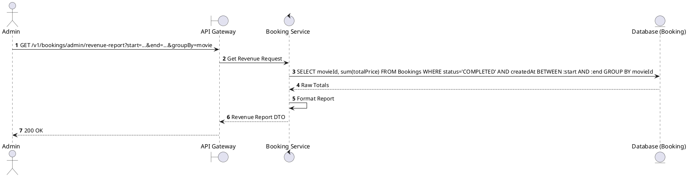
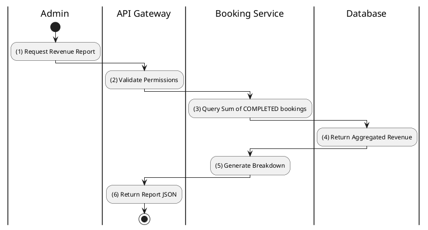

# [BK-A09] Get Revenue Report

## 1. Description

| Field | Details |
| :--- | :--- |
| **Name** | Get Revenue Report |
| **Functional ID** | BK-A09 |
| **Description** | Generates a report of total revenue generated from bookings within a specific period, broken down by movie or cinema. |
| **Actor** | Admin |
| **Trigger** | `GET /v1/bookings/admin/revenue-report` |
| **Pre-condition** | Admin authenticated; Valid date range and grouping parameters. |
| **Post-condition** | Revenue report data returned. |

## 2. Sequence Flow

## 3. Activity Flow

## 4. Business Rules

| Activity Step | Rule ID | Description |
| :--- | :--- | :--- |
| (3) | N/A | Only `COMPLETED` (and possibly `CONFIRMED`) bookings are counted towards revenue. `CANCELLED` or `EXPIRED` are excluded. |
| (3) | BR-PAY-03 | Reports should clearly distinguish between gross revenue and net revenue (minus 10% VAT). |
