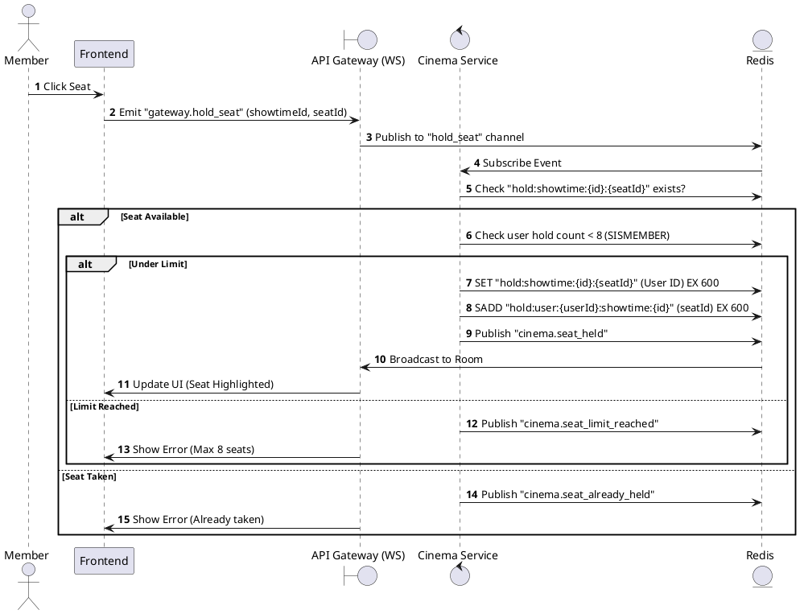
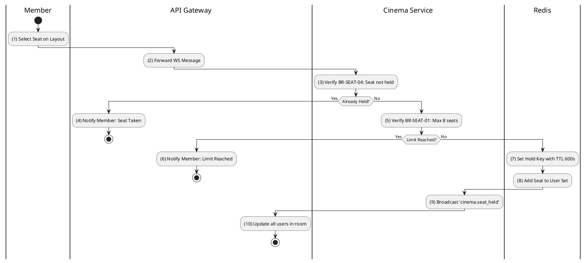

# [RT-01] Hold Seat

## 1. Description

| Field | Details |
| :--- | :--- |
| **Name** | Hold Seat |
| **Functional ID** | RT-01 |
| **Description** | Allows a member to temporarily lock a seat for 10 minutes while they complete their booking. This is a real-time operation using WebSockets and Redis. |
| **Actor** | Member |
| **Trigger** | WebSocket Event `gateway.hold_seat` |
| **Pre-condition** | Member authenticated; Showtime session active; Seat is currently 'Available'. |
| **Post-condition** | Seat status updated to 'Held' in Redis; Event broadcasted to other users. |

## 2. Sequence Flow

## 3. Activity Flow

## 4. Business Rules

| Activity Step | Rule ID | Description |
| :--- | :--- | :--- |
| (5) | BR-SEAT-01 | Maximum seats per user per showtime: 8 seats. |
| (7) | BR-SEAT-02 | Seat hold duration (TTL): 10 minutes (600 seconds). |
| (3) | BR-SEAT-04 | A seat cannot be held if it is already held by another user. |
