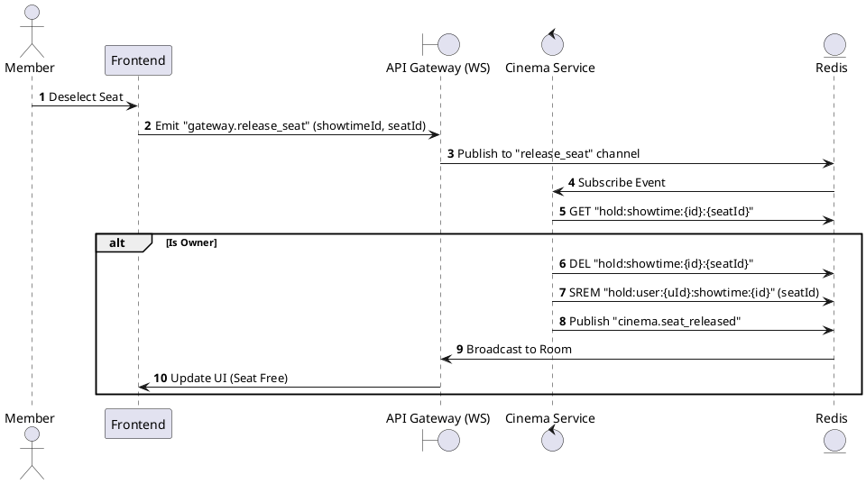
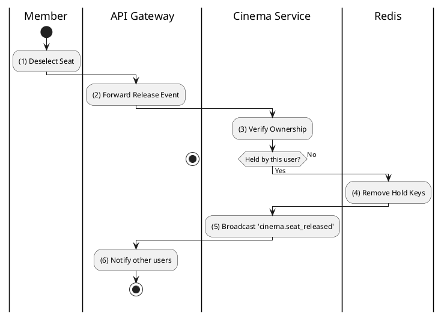

# [RT-02] Release Seat

## 1. Description

| Field | Details |
| :--- | :--- |
| **Name** | Release Seat |
| **Functional ID** | RT-02 |
| **Description** | Allows a member to manually release a seat they previously held. |
| **Actor** | Member |
| **Trigger** | WebSocket Event `gateway.release_seat` |
| **Pre-condition** | Member holds the seat. |
| **Post-condition** | Seat removed from Redis; Event broadcasted as 'Available'. |

## 2. Sequence Flow

## 3. Activity Flow

## 4. Business Rules

| Activity Step | Rule ID | Description |
| :--- | :--- | :--- |
| (3) | N/A | Users can only release seats they have personally held. |
