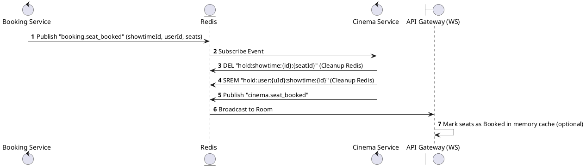
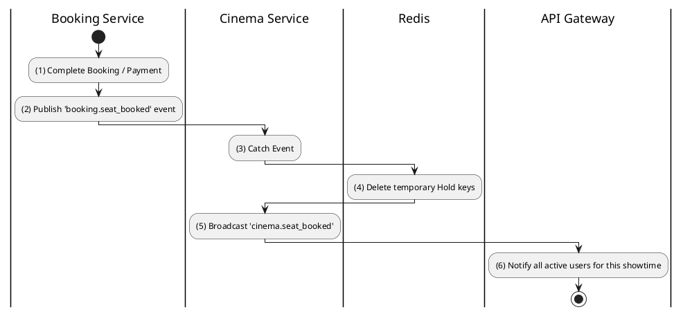

# [RT-03] Confirm Seat Booked

## 1. Description

| Field | Details |
| :--- | :--- |
| **Name** | Confirm Seat Booked |
| **Functional ID** | RT-03 |
| **Description** | Transitions a seat from 'Held' to 'Booked' status in the real-time layout once the booking is confirmed by the system. |
| **Actor** | System |
| **Trigger** | Redis Event `booking.seat_booked` |
| **Pre-condition** | Booking process successfully completed. |
| **Post-condition** | Seat status updated permanently for the duration of the showtime. |

## 2. Sequence Flow

## 3. Activity Flow

## 4. Business Rules

| Activity Step | Rule ID | Description |
| :--- | :--- | :--- |
| (4) | N/A | Real-time "Hold" state is temporary. Permanent "Booked" state is derived from Database (Postgres) but broadcasted via WebSocket for UX. |
