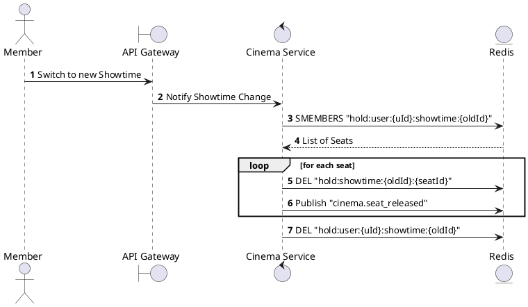
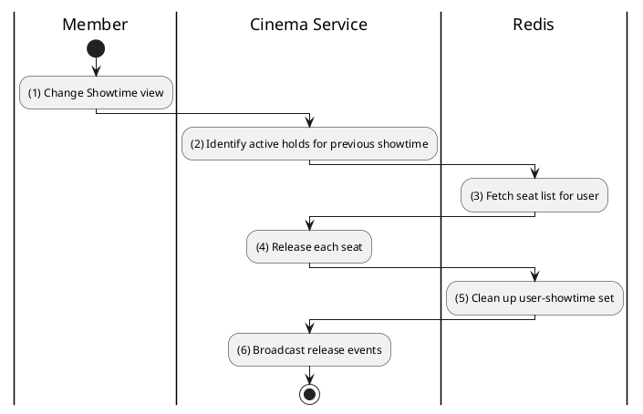

# [RT-04] Clear Old Showtime Session

## 1. Description

| Field | Details |
| :--- | :--- |
| **Name** | Clear Old Showtime Session |
| **Functional ID** | RT-04 |
| **Description** | Automatically releases all held seats from a previous showtime when a user navigates to a new showtime. |
| **Actor** | System |
| **Trigger** | Internal (Detect showtime change in client/gateway) |
| **Pre-condition** | User has held seats for a different showtime. |
| **Post-condition** | Previous showtime's seats released in Redis. |

## 2. Sequence Flow

## 3. Activity Flow

## 4. Business Rules

| Activity Step | Rule ID | Description |
| :--- | :--- | :--- |
| (2) | BR-SEAT-03 | When a user selects a new showtime, all previously held seats from other showtimes are automatically released. |
