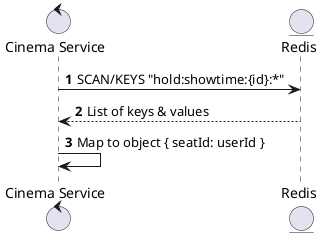
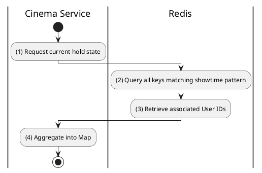

# [RT-05] Get All Held Seats

## 1. Description

| Field | Details |
| :--- | :--- |
| **Name** | Get All Held Seats |
| **Functional ID** | RT-05 |
| **Description** | Internal API call to retrieve all currently held seats for a showtime, typically used during initial layout load. |
| **Actor** | System |
| **Trigger** | Internal Service Call |
| **Pre-condition** | Showtime ID provided. |
| **Post-condition** | Map of seatId -> userId returned. |

## 2. Sequence Flow

## 3. Activity Flow

## 4. Business Rules

| Activity Step | Rule ID | Description |
| :--- | :--- | :--- |
| (2) | N/A | Efficient scanning of Redis is required to avoid blocking the main thread. |
