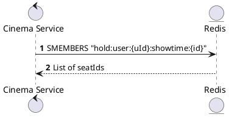
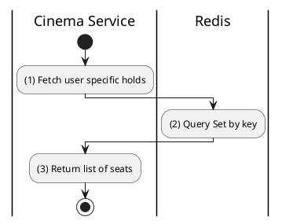

# [RT-06] Get User Held Seats

## 1. Description

| Field | Details |
| :--- | :--- |
| **Name** | Get User Held Seats |
| **Functional ID** | RT-06 |
| **Description** | Retrieves the specific list of seats currently held by the authenticated user for a given showtime. |
| **Actor** | System |
| **Trigger** | Internal Service Call |
| **Pre-condition** | User ID and Showtime ID provided. |
| **Post-condition** | List of seat IDs returned. |

## 2. Sequence Flow

## 3. Activity Flow

## 4. Business Rules

| Activity Step | Rule ID | Description |
| :--- | :--- | :--- |
| (2) | N/A | Used to highlight which seats are "Yours" vs "Others" on the UI. |
