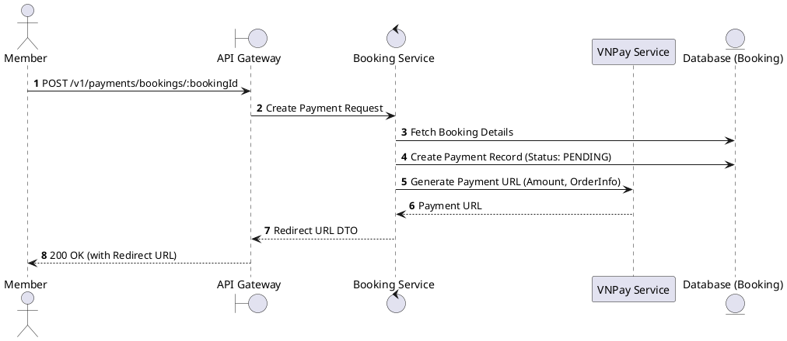
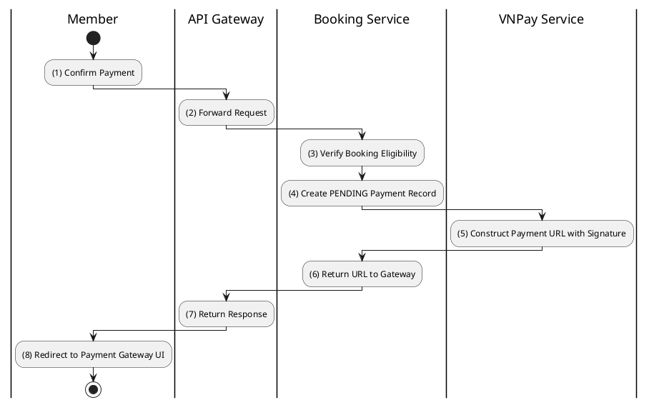

# [PY-01] Create Payment

## 1. Description

| Field | Details |
| :--- | :--- |
| **Name** | Create Payment |
| **Functional ID** | PY-01 |
| **Description** | Initiates a payment transaction for a specific booking using a chosen payment gateway (e.g., VNPay). |
| **Actor** | Member |
| **Trigger** | `POST /v1/payments/bookings/:bookingId` |
| **Pre-condition** | Booking exists and status is PENDING; Member authenticated. |
| **Post-condition** | Payment record created (PENDING); Redirect URL generated for the member. |

## 2. Sequence Flow

## 3. Activity Flow

## 4. Business Rules

| Activity Step | Rule ID | Description |
| :--- | :--- | :--- |
| (3) | BR-BOOK-01 | Payment must be initiated within 15 minutes of booking creation. |
| (5) | N/A | URL must include a secure hash (HMAC-SHA512) for integrity. |
