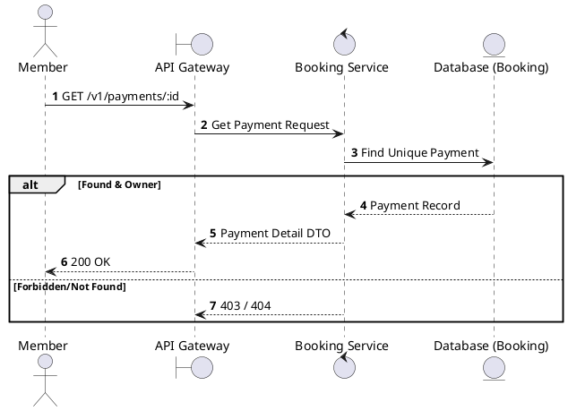
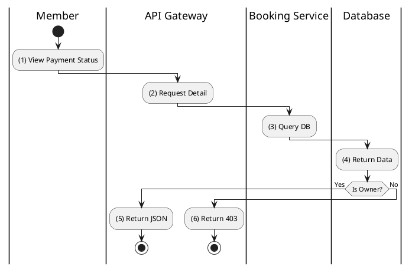

# [PY-02] Get Payment Details

## 1. Description

| Field | Details |
| :--- | :--- |
| **Name** | Get Payment Details |
| **Functional ID** | PY-02 |
| **Description** | Retrieves the status and transaction details of a specific payment. |
| **Actor** | Member |
| **Trigger** | `GET /v1/payments/:id` |
| **Pre-condition** | Member authenticated; Payment ID exists and belongs to the member. |
| **Post-condition** | Payment record details returned. |

## 2. Sequence Flow

## 3. Activity Flow

## 4. Business Rules

| Activity Step | Rule ID | Description |
| :--- | :--- | :--- |
| (3) | N/A | Only the member who initiated the payment can view its details. |
