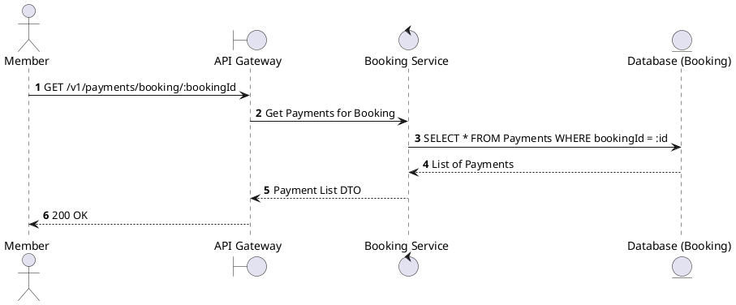
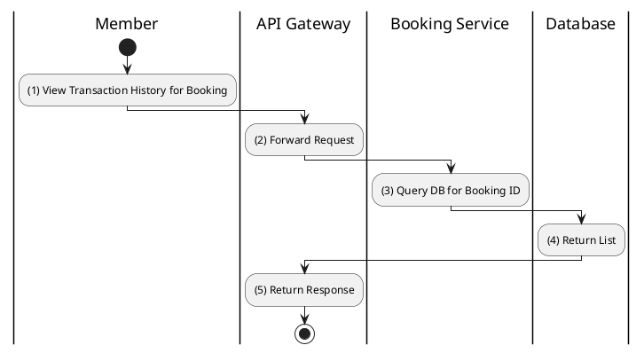

# [PY-03] Get Payments by Booking

## 1. Description

| Field | Details |
| :--- | :--- |
| **Name** | Get Payments by Booking |
| **Functional ID** | PY-03 |
| **Description** | Lists all payment attempts associated with a specific booking. |
| **Actor** | Member |
| **Trigger** | `GET /v1/payments/booking/:bookingId` |
| **Pre-condition** | Member authenticated; Booking belongs to the member. |
| **Post-condition** | List of payment records returned. |

## 2. Sequence Flow

## 3. Activity Flow

## 4. Business Rules

| Activity Step | Rule ID | Description |
| :--- | :--- | :--- |
| (3) | N/A | Useful for tracking failed attempts and final successful payment. |
| (3) | N/A | Only accessible to the booking owner. |
