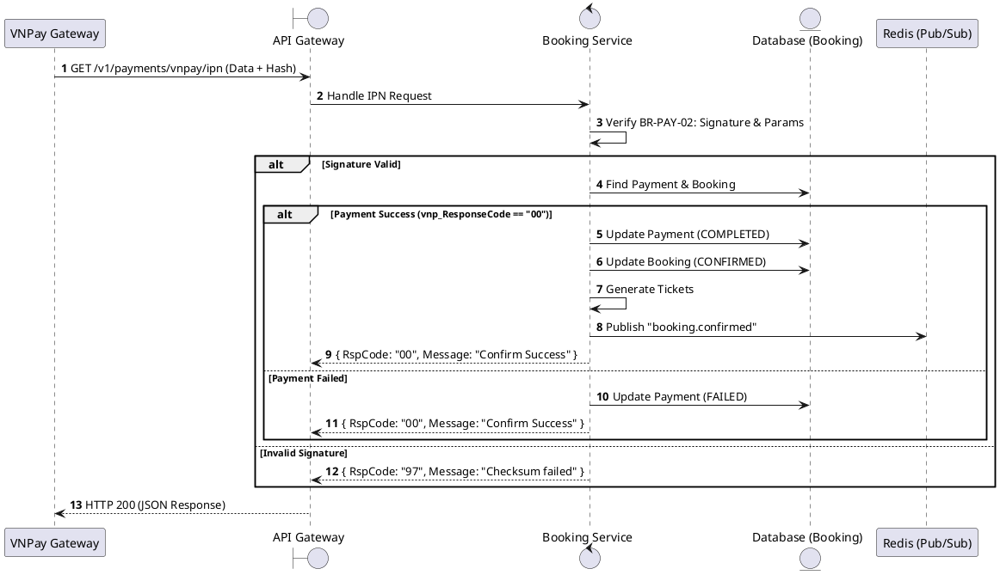
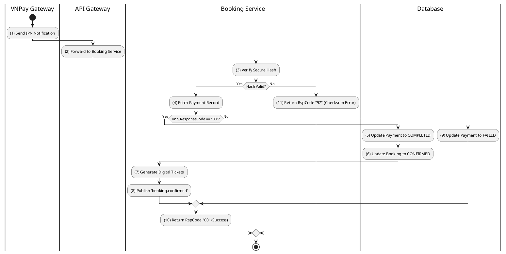

# [PY-04] VNPay IPN Webhook

## 1. Description

| Field | Details |
| :--- | :--- |
| **Name** | VNPay IPN Webhook |
| **Functional ID** | PY-04 |
| **Description** | An asynchronous callback from VNPay to update the payment and booking status after a transaction is completed by the user. |
| **Actor** | System (VNPay) |
| **Trigger** | `GET /v1/payments/vnpay/ipn` |
| **Pre-condition** | Request includes valid VNPay parameters and signature. |
| **Post-condition** | Payment status updated; Booking status confirmed if successful; Tickets generated. |

## 2. Sequence Flow

## 3. Activity Flow

## 4. Business Rules

| Activity Step | Rule ID | Description |
| :--- | :--- | :--- |
| (1) | BR-PAY-01 | VNPay IPN webhook is unauthenticated (public endpoint) but verified by hash. |
| (3) | BR-PAY-02 | VNPay IPN must return exact format: `{ RspCode: string, Message: string }`. |
| (6) | N/A | Booking status transition: PENDING -> CONFIRMED. |
