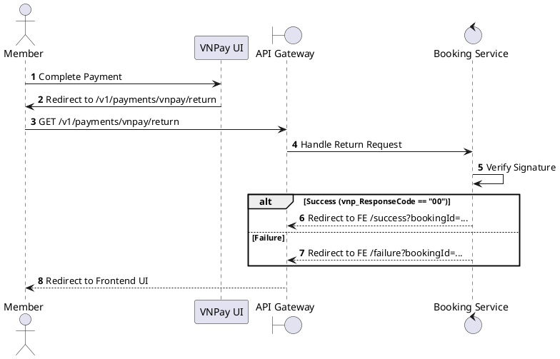
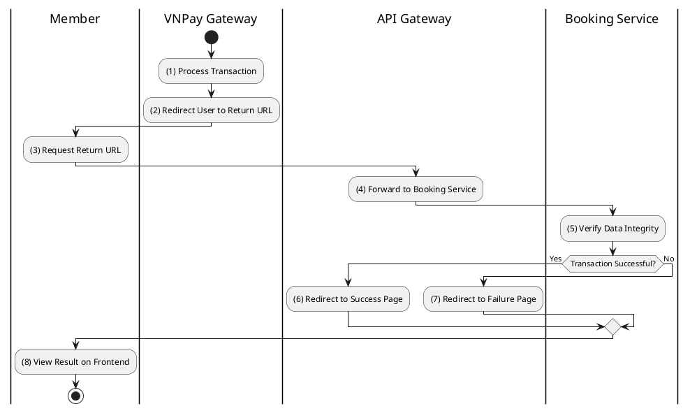

# [PY-05] VNPay Return URL

## 1. Description

| Field | Details |
| :--- | :--- |
| **Name** | VNPay Return URL |
| **Functional ID** | PY-05 |
| **Description** | The browser redirect endpoint where users are sent after completing payment on the VNPay UI. It provides immediate feedback to the user. |
| **Actor** | Member |
| **Trigger** | `GET /v1/payments/vnpay/return` |
| **Pre-condition** | User redirected from VNPay. |
| **Post-condition** | User redirected to Frontend success or failure page. |

## 2. Sequence Flow

## 3. Activity Flow

## 4. Business Rules

| Activity Step | Rule ID | Description |
| :--- | :--- | :--- |
| (5) | N/A | Immediate feedback only. Data consistency is guaranteed by PY-04 (IPN). |
| (6) | N/A | Success page should display booking summary and link to tickets. |
