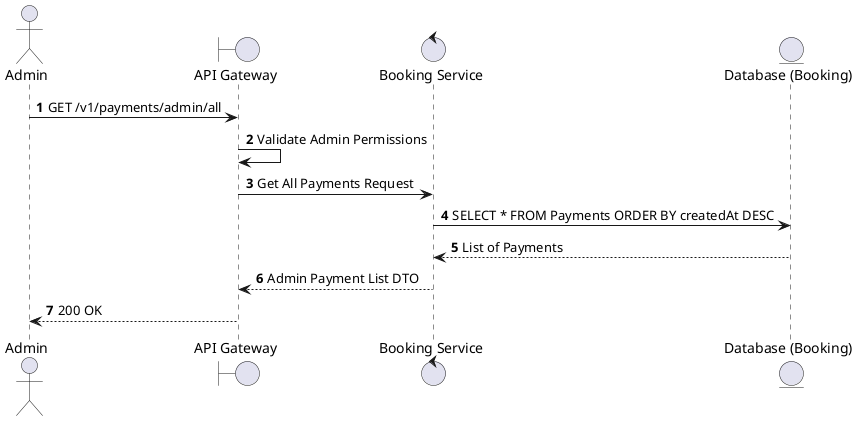
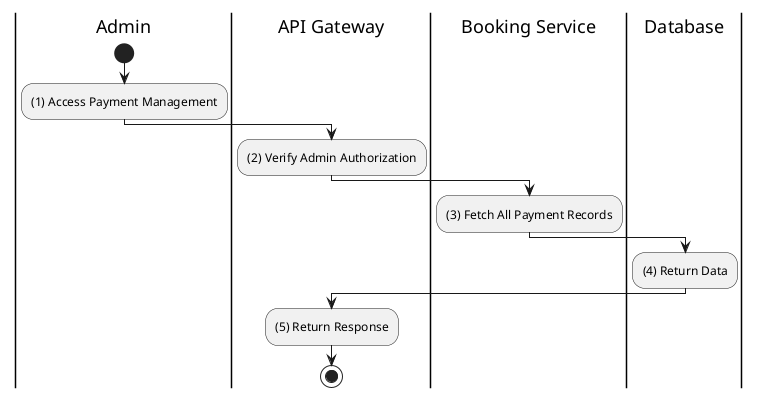

# [PY-A01] Admin List All Payments

## 1. Description

| Field | Details |
| :--- | :--- |
| **Name** | Admin List All Payments |
| **Functional ID** | PY-A01 |
| **Description** | Allows Administrators to view a comprehensive list of all payment transactions in the system. |
| **Actor** | Admin |
| **Trigger** | `GET /v1/payments/admin/all` |
| **Pre-condition** | Admin authenticated. |
| **Post-condition** | Paginated list of all payments returned. |

## 2. Sequence Flow

## 3. Activity Flow

## 4. Business Rules

| Activity Step | Rule ID | Description |
| :--- | :--- | :--- |
| (2) | N/A | Access is restricted to Admin role. |
| (3) | N/A | Includes details like Transaction Reference, Gateway Response, and Amount. |
