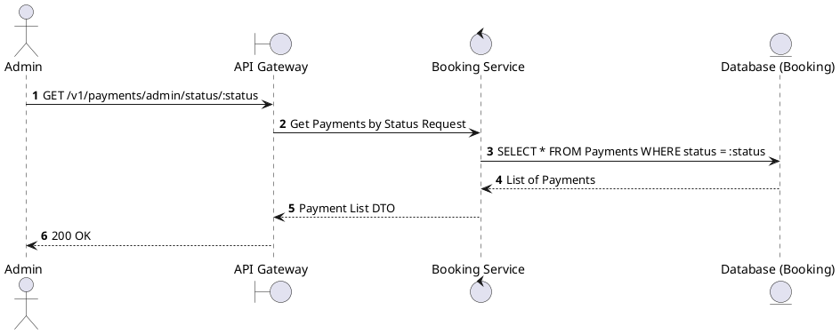
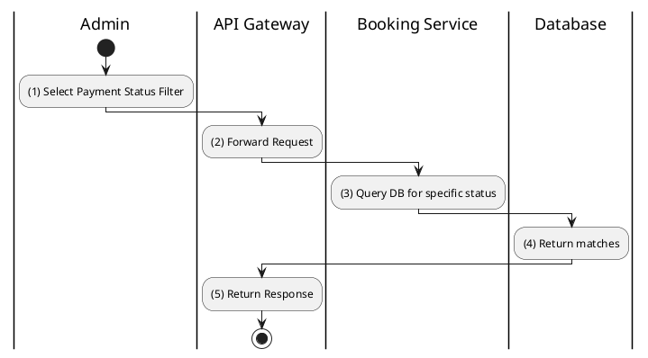

# [PY-A02] Find Payments by Status

## 1. Description

| Field | Details |
| :--- | :--- |
| **Name** | Find Payments by Status |
| **Functional ID** | PY-A02 |
| **Description** | Allows an Admin to filter the payment list by status (e.g., PENDING, COMPLETED, FAILED). |
| **Actor** | Admin |
| **Trigger** | `GET /v1/payments/admin/status/:status` |
| **Pre-condition** | Admin authenticated; Status is a valid `PaymentStatus`. |
| **Post-condition** | List of matching payments returned. |

## 2. Sequence Flow

## 3. Activity Flow

## 4. Business Rules

| Activity Step | Rule ID | Description |
| :--- | :--- | :--- |
| (3) | SRS 5.2 | Valid values: `PENDING`, `PROCESSING`, `COMPLETED`, `FAILED`, `REFUNDED`. |
